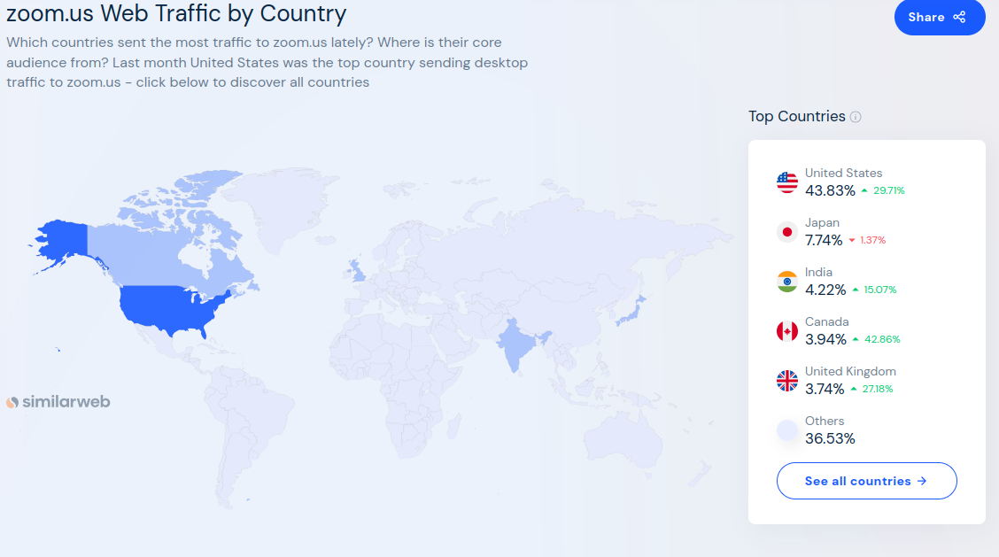
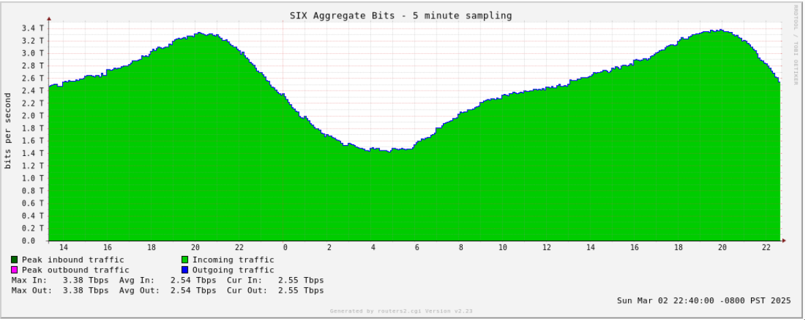
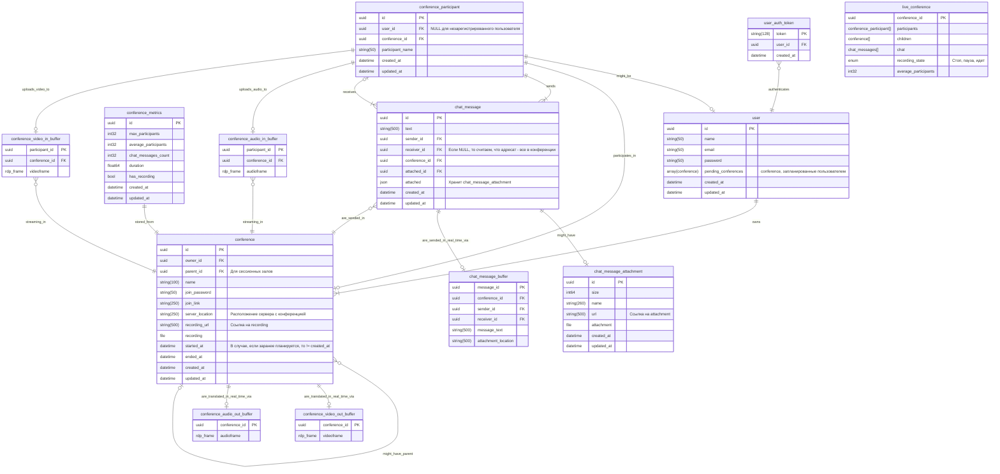

# Проектирование высоконагруженных систем. Zoom

Данный файл предназначен для документирования работы и принятых решений
в рамках курса проектирования высоконагруженных систем.

<!-- mtoc-start -->

* [1. Тема и целевая аудитория](#1-тема-и-целевая-аудитория)
  * [Продукт](#продукт)
  * [Функционал MVP](#функционал-mvp)
    * [Ключевые продуктовые решения](#ключевые-продуктовые-решения)
  * [Анализ целевой аудитории](#анализ-целевой-аудитории)
    * [Методологии оценки](#методологии-оценки)
      * [Monthly Active Users](#monthly-active-users)
      * [Распределение пользователей по миру](#распределение-пользователей-по-миру)
    * [Готовые цифры](#готовые-цифры)
    * [География пользователей](#география-пользователей)
* [2. Расчет нагрузки](#2-расчет-нагрузки)
  * [Продуктовые метрики](#продуктовые-метрики)
    * [Расчет средних значений](#расчет-средних-значений)
    * [Сводная таблица](#сводная-таблица)
  * [Технические метрики](#технические-метрики)
    * [Расчет размеров хранения медиафайлов](#расчет-размеров-хранения-медиафайлов)
    * [Расчет сетевого трафика](#расчет-сетевого-трафика)
    * [Расчет RPS](#расчет-rps)
* [3. Глобальная балансировка нагрузки](#3-глобальная-балансировка-нагрузки)
  * [Выбор и схема балансировки](#выбор-и-схема-балансировки)
  * [Разделение RPS по датацентрам](#разделение-rps-по-датацентрам)
* [4. Локальная балансировка нагрузки](#4-локальная-балансировка-нагрузки)
  * [Схема балансировки внешних запросов](#схема-балансировки-внешних-запросов)
  * [Схема балансировки межсервисных запросов](#схема-балансировки-межсервисных-запросов)
  * [Схема отказоустойчивости](#схема-отказоустойчивости)
  * [Терминация SSL](#терминация-ssl)
* [5. Логическая схема БД](#5-логическая-схема-бд)
  * [Описание сущностей](#описание-сущностей)
  * [Нагрузка на сущности](#нагрузка-на-сущности)
  * [Особенности поддержания консистентности сущностей](#особенности-поддержания-консистентности-сущностей)
* [6. Физическая схема БД](#6-физическая-схема-бд)
  * [Выбор индексов](#выбор-индексов)
  * [Денормализация](#денормализация)
  * [Выбор СУБД](#выбор-субд)
  * [Шардирование и резервирование СУБД (потаблично)](#шардирование-и-резервирование-субд-потаблично)
  * [Балансировка запросов / мультиплексирование подключений](#балансировка-запросов--мультиплексирование-подключений)
  * [Схема резервного копирования](#схема-резервного-копирования)
* [Список источников](#список-источников)

<!-- mtoc-end -->

## 1. Тема и целевая аудитория

### Продукт

Zoom - это платформа для проведения видеоконференций, которая в настоящее время
позиционирует себя как "рабочее место", включающее в себя коллективный чат,
доски, заметки, почтовый клиент, работу с документами и так далее.
Продукт приобрел широкую популярность благодаря пандемии и с тех пор занимает
лидирующее место среди аналогов.

Основной способ монетизации - разного рода подписки.

### Функционал MVP

* Регистрация и авторизация
* Создание конференции и подключение к ней
* Отдельные комнаты в рамках одной конференции (сессионные залы в терминах zoom)
* Запись конференции
* Чат в конференции (с возможностью прикладывать файлы)

#### Ключевые продуктовые решения

* Подключение к конференции не требует регистрации (по ссылке или id и паролю)
* Запись конференции происходит на стороне сервиса  
  (но возможна и локальная, её проектировать не будем)
* Чат также записывается при записи конференции

### Анализ целевой аудитории

Сразу обозначим, что вся доступная информация касательно аудитории zoom
приводится в открытых источниках только на момент разгара пандемии
(до 2021 года). Поэтому на самом деле мы будем проектировать zoom образца 2020 года.

#### Методологии оценки

В данном разделе описано, как рассчитаны показатели, явно отсутствующие в источниках.

##### Monthly Active Users

Zoom ни разу не публиковал данную метрику в открытый доступ, поэтому остается только
лишь её оценивать по другим показателям.
Казалось бы, можно было бы использовать статистику по уникальным посетителям
веб-сайта zoom.us [1]. Отметим несколько фактов, которые ответят нам на
вопрос "Можно ли?":

1. Подключение к конференции возможно по ссылке и по логину с паролем. В
   случае подключения по ссылке человек проходит через сайт zoom.us, однако
   только если он пользуется десктопной версией.
2. У zoom есть веб-клиент, а потому пользователи веб-клиента также
   считаются в эту метрику.

Таким образом, строго опираться на данную метрику нельзя, так как

* Не учитываются пользователи мобильных приложений;
* Не учитываются пользователи, подключающиеся не по ссылке.
* Учитываются боты и другие пользователи, не относящиеся к категории активных

Далее, приведем косвенную оценку MAU на конец 2020 года (4-й квартал).
Для данного периода нам известно

* Среднее время конференции (T): 54 минуты  [2]
* Среднее число человек, участвующих в конференции (n): 10  [2]
* Ожидаемое годовое число минут конференций ($t_{total}$): 3.3 триллиона минут.
   (zoom рассчитал эту метрику, умножив суммарное число минут конференций
   за декабрь 2020 на 12). [3]

Пусть число конференций, проведенных месяц, будет равно $N_{сум}$.
Тогда

$N_{сум} = \frac{t_{total}}{12T} = \frac{101 \cdot 10^{9}}{12 \cdot 54} \approx 155864197.5 \approx 156$ ($млн.)

В худшем случае, каждая из этих конференций содержала уникальных людей. С учетом
средней численности человек в конференции, оценкой сверху для MAU является

$\textit{MAU}_{max} = n * N = 10 \cdot 156 = 1.6 (млрд. чел)$

Итого мы получили крайне завышенное значение, которое нельзя использовать для расчета.

Придем к последнему варианту оценки. Возьмем в качестве оценки MAU
значение, которое публикует конкурент для своего продукта относительно
объема рынка, которое он занимает.
Так, Microsoft Teams заявляет 320 млн. MAU [4] на начало 2024 года.
Кроме того, zoom занимает 55.91% рынка, а Teams - 32.29% [5]. Значит
можно полагать, что

$\textit{MAU} \approx 320\cdot\frac{55.91}{32.29} \approx 554$ (млн.)

Отметим, что данное значение помещается в пределы оценки и выше
DAU (300 млн.) [6], значит можем использовать.

##### Распределение пользователей по миру

Для оценки этого параметра можем считать, что распределение пользователей,
которые генерируют трафик на zoom.us и пользователей, которые входят
в активную аудиторию совпадают.
Также был проверен и трафик других доменов zoom, но на них распределение
приблизителльно совпадало.

#### Готовые цифры

* 300 млн. Daily Active Users [6] (на 2020 год, но других данных нет)
* 554 млн. Monthly Active Users*

\*показатель получен косвенным путем

#### География пользователей

| Страна         | %     | MAU, млн. | DAU, млн. |
|----------------|-------|-----------|-----------|
| США            | 43.83 | 242.8     | 131.5     |
| Япония         | 7.74  | 42.9      | 23.2      |
| Индия          | 4.22  | 23.4      | 12.7      |
| Канада         | 3.94  | 21.8      | 11.8      |
| Великобритания | 3.74  | 20.7      | 11.2      |
| Остальные      | 36.53 | 202.4     | 109.6     |

## 2. Расчет нагрузки

### Продуктовые метрики

#### Расчет средних значений

Число регистраций можно оценить по отчету прибыли [7].
Сначала оценим долю MAU, которую составляют платные пользователи. Это
можно сделать, поделив выручку компании на цену платной подписки (\$12.5) [8].

$\textit{MAU}_\text{плат} \approx \frac{1146}{12.5} = 91.68$ (млн. чел)

Примем, что прирост платных пользователей для короткого срока (месяц-два)
имеет прямую пропорциональную зависимость с приростом всех пользователей, что
и означает регистрация. Тогда имеет место соотношение для числа регистраций в
месяц

$R=\Delta\textit{MAU}_\text{плат}\frac{\textit{MAU}}{\textit{MAU}_\text{плат}}$

$R \approx\frac{1146 - 1118}{12.5}\cdot\frac{554.00}{91.68}\approx 13.54$ (млн.)

Усредняя это число для суточного периода, имеем

$R_\text{ср. дн} = \frac{13.54}{30} \approx 0.451$ (млн.)

Для числа авторизаций проведем оценку сверху. Для этого
допустим, что все пользователи zoom авторизуются (в том
числе и те, кто анонимно заходит в конференцию).
Кроме того, допустим также, что пользователи заходят в
zoom каждый рабочий день (5 дней в неделю и 20 в месяц).

Кроме того, отметим мои собственные наблюдения:

* Для авторизаций на сайте zoom создает сессионную куку,
которая уничтожается при перезаходе в браузер (время жизни session).
* При каждом входе в приложение zoom обновляет авторизацию, будь то
авторизация по его собственным механизмам или же с помощью oauth.

Итого будем считать за авторизацию каждый заход в приложение или
на сайт в рамках браузерной сессии. Тогда за месяц в среднем
человек будет заходить в zoom 20 раз (по раз за рабочий день).
Итого будем иметь среднее число авторизаций за месяц

$A = 20 \cdot MAU = 11080 = 11.08$ (млрд. в мес).  
$A_\text{ср. дн} = \frac{A}{30} = \frac{11080}{30} \approx 369$ (млн. в день)

Число созданий конференций можно оценить по самому числу
конференций. Уже известно, что
среднее число конференций в месяц равно 156 млн. Тогда в день имеем

$N_\text{ср. дн} = \frac{156}{30} \approx 5.2$ (млн.)

Учитывая среднее число участников конференций (10 человек), среднее
число участий будет равно

$5.2 \cdot 10 = 52$ (млн.)

Примем, что каждая третья конференция Zoom записывается.
Тогда среднее число записей будет равно

$5.2 / 3 = 1.73$ (млн.)

Примем, что каждый пользователь в среднем оставляет 10 сообщений в чате.
При этом 10% сообщений прикладывают файл.
Тогда среднее число сообщений в чате равно

$52 \cdot 10 = 520$ (млн.),

а среднее число файлов в чате

$520 \cdot 0.1 = 52$ (млн.)

Пусть только 10% конференций содержат сессионные залы.
При этом в среднем их будет 3. Тогда  
Среднее число созданий сессионного зала  $5.2 \cdot 0.1 \cdot 3 = 1.56$ млн.  
Среднее число участий в сессионном зале  $52 \cdot 0.1 \cdot 3 = 15.6$ млн.  
Среднее число записей сессионного зала  $1.73 \cdot 0.1 \cdot 3 = 0.519$ млн.

Средний размер хранилища пользователя складывается из
среднего объема записей конференций и медиафайлов в чате.
Его оценка приведена в разделе с техническими метриками.

#### Сводная таблица

| Метрика | млн. пользователей |
|---------|--------------------|
| DAU     | 300                |
| MAU     | 554                |

Средний размер хранилища пользователя: 1.15 ГБ. (Расчет для него приведен далее).

| Действие пользователя    | Среднее количество в сутки, шт. |
|--------------------------|---------------------------------|
| Регистрация              |         0.451 млн.              |
| Авторизация              |         369 млн.                |
| Создание конференции     |         5.2 млн.                |
| Участие в конференции    |         52 млн.                 |
| Запись конференции       |        1.73 млн.                |
| Сообщение в чате         |        520 млн.                 |
| Файл в чате              |        52 млн.                  |
| Создание сессионного зала|        1.56 млн.                |
| Участие в сессионном зале|        15.6 млн.                |
| Запись сессионного зала  |        0.519 млн.               |

\* В сущности числа для сессионых залов необязательны, так как сессионный зал является
подвидом конференции.  

### Технические метрики

#### Расчет размеров хранения медиафайлов

Произведем расчет для медиафайлов. Начнем с самого простого - размера файла.
Известно, что в Zoom максимальный размер файла, который можно прикрепить,
равен 1 Гб [9]. Однако далеко не все люди прикрепляют
такие файлы. Поэтому примем, что средний размер файла 10 Мб.

Далее, расчитаем размер записи конференции. Считать будем исходя из того,
что Zoom умеет передавать видео в формате FullHD 1080p [10].

Также отметим особенности Zoom. На записи он показывает только один экран
одновременно. Кроме того, Zoom также
предоставляет записи в формате mp4. Примем, исходя из данных [11] о битрейте, что
в записи хранится картинка максимального качества с битрейтом 3.8 Мбит/c. Тогда
средняя конференция Zoom (54 минуты) занимает

$V = 3.8 \cdot 60 \cdot 54  = 12$ (Гбайт.)

Для размера потока живой конференции мы также можем взять данные Zoom, а именно
битрейт для групповых звонков 3.8 Мбит/с. (Это битрейт для максимального качества
конференции. Но так как мы занимаемся проектированием, то разумно брать запасы).

С учетом того что сессионные залы это тоже конференции, расчет для них не отличается.

Отсюда мы можем получить средний объем хранилища пользователя как суммарное число
записанных конференций плюс суммарное число файлов, приходящихся на одного пользователя.

$V_\text{пол. ср} = \frac{30}{MAU} \left[ V N_\text{зап. сут} + V_\text{файл. ср} N_\text{файл. сут.} \right]$

$V_\text{пол. ср} = \frac{30}{554 \cdot 10^6} \left[ 12 \cdot 1.73 \cdot 10^6 + 10 / 1024 \cdot 52 \cdot 10^6 \right] \approx 1.15$ (Гбайт)

#### Расчет сетевого трафика

Основной трафик, который генерируется в рамках zoom, генерируется за счет
конференций. А потому, расчет
нужен только для видео и файлов.

Для видео уже посчитали битрейт 3.8 Мбит/с на конференцию,
а также средний размер конференции 12 Гбайт.
С учетом их количества, имеем

$12 \cdot 1.73\approx 20.76$ (млн. Гбайт. в сутки)

Для файлов аналогично найдем

$10 / 1024 \cdot 52 \approx 0.51$ (млн. Гбайт в сутки)

Для подсчета пиковых значений было проведено следующее исследование:

* Был проведен поиск статистики по дневному трафику zoom
* Был проведен поиск статистики по дневному трафику аналогов zoom
* Был проведен поиск графиков дневного трафика на технических конференциях

Ни один из обозначенных выше способов не дал результата, поэтому для подсчета
пикового RTS возьмем график трафика через один из internet exchange. Это
можно использовать для оценки, так как

* Графики локального трафика приблизительно имеют одну и ту же форму
* Около половины аудитории zoom расположены в США и США обладает достаточно
  близкими часовыми поясами (максимальная разница во времени 6 часов), что
  подойдет для оценки.

Для расчета возьмем форму графика трафика, которым поделился SeattleIX [12].

Далее, берем период с 22:00 до 22:00 следующего дня, интегрируем его и делим на 24
часа. Получим среднее значение для трафика для SIX. Далее, с помощью пропорции получаем
отношение пикового трафика к среднему. И это отношение используем для расчета пикового
RPS и сетевого трафика.

Для SIX средний трафик приведен на картинке и равен 2.54 Тб. Причем его максимальное
значение
равно 3.38 Тб. Таким образом, коэффициент перегрузки трафика равен

$K = \frac{3.38}{2.54} \approx 1.33$

Подобные графики были просмотрены и для других IX. Для запаса берем коэффициент
перегрузки 1.5.

Теперь посчитаем пиковый трафик для медиафайлов. Для этого сначала считаем
среднесуточный трафик, а затем умножаем его на коэффициент перегрузки.

Для видеопотоков получается

* Средний $20.76 \cdot 10^6 / 24 / 60 / 60 \approx 240$ (Гбайт в сек)
* Пиковый $240 \cdot 1.5 = 360 = 2880$ (Гбит в сек)

Для файлов в чате

* Средний $0.51 \cdot 10^6 / 24 / 60 / 60 \approx 6$ (Гбайт в сек)
* Пиковый $6 \cdot 1.5 = 72$ (Гбит в сек)

#### Расчет RPS

Средний RPS был посчитан из продуктовых метрик в расчете не секунду по
формуле

$RPS = \frac{M_\text{ср}}{24 \cdot 60 \cdot 60}$,

где M - среднее значение метрики за сутки.

Пиковый же RPS получен из среднего при помощи коэффициента, рассчитанного
ранее.

| Действие пользователя    | Средний RPS  | Пиковый RPS |
|--------------------------|--------------|-------------|
| Регистрация              |        5.22  |       7.83  |
| Авторизация              |        4270  |       6405  |
| Создание конференции     |        60    |       90    |
| Участие в конференции    |        600   |       900   |
| Запись конференции       |        20    |       30    |
| Сообщение в чате         |        6018  |       9027  |
| Файл в чате              |        602   |       903   |
| Создание сессионного зала|        18    |       27    |
| Участие в сессионном зале|        180   |       270   |
| Запись сессионного зала  |        6     |       9     |

## 3. Глобальная балансировка нагрузки

### Выбор и схема балансировки

В качестве метода балансировки нагрузки выберем DNS балансировку
нагрузки. Выбор связан с тем, что наша целевая аудитория широко
распространена по Земле и использование BGP Anycast было бы
затруднительно, так как оно требует наличие автономной системы
мировых размеров.

Среди типов DNS балансировки нам может подойти Geo-based DNS или
Latency-based DNS. Остановим свой выбор на последнем, так как
задержка для сервиса является более важным критерием. Кроме того,
можно руководствоваться следующими доводами:

* Сервер, транслирующий пользователям видеоконференцию, и получающий
  от них потоки, один (с возможностью замены) и является
  stateful-приложением.
* Если пользователи располагаются географически рядом (в пределах города),
  то вероятнее всего их распределит на одинаковый датацентр (для любого из
  приведенных выше способов балансировки)
* Если пользователи располагаются далеко друг от друга географически, то
  достоинства обоих DNS-балансировщиков нивелируются.

Исходя из вышеуказанного, Latency-based DNS будет лучшим выбором.

Остается лишь распределить датацентры по миру согласно нашей аудитории.
Напомним, что пропорции мировой аудитории распределены следующим образом:

* США 43.83%
* Япония 7.74%
* Индия 4.22%
* Канада 3.84%
* Великобритания 3.74%
* Остальной мир 36.53%

Таким образом, из анализа этих процентов, следует разместить по паре
датацентров в США на разных географических точках. Они будут обслуживать
клиентов из США и Канады. Также нужна пара датацентров в Японии, Европе
(один из которых нужен в Лондоне) и Индии.

Каждая пара из близко-расположенных датацентров
(по регионам, регионы обозначены ниже) балансируется после DNS балансировки
при помощи BGP Anycast. Это уже становится возможным, так как размеры
получившейся автономной системы уже куда более скромны.

Итого, выбираем следующие датацентры [13]:

* Северная Виржиния (Восток США), 12.48% аудитории
* Огайо (Восток США), 12.48% аудитории
* Орегон (Запад США), 12.48% аудитории
* Северная Калифорния (Запад США), 12.48% аудитории
* Лондон (Западная Европа) 15.91% аудитории
* Франкфурт (Западная Европа) 12.17% аудитории
* Осака (Япония) 3.87% аудитории
* Токио (Япония) 3.87% аудитории
* Хайдарабад (Индия) 2.11% аудитории
* Мумбаи (Индия) 2.11% аудитории

На будущее сервиса стоит также задуматься о строительстве датацентров в
других мировых регионах, к примеру в Южной Америке и Восточной Европе. Мы не
стали их располагать, так как мало информации о том, какая часть из аудитории
остального мира находится в этих регионах.

Расчет распределения аудитории произведен на основании допущения,
что жители одного региона (указан в скобках) равномерно обращаются
к датацентрам (естественно, это не так, но других данных нет). Кроме того, мы считаем,
что жители Канады идут в датацентры США, а также что остальной мир на
2/3 это жители Европы, а оставшаяся треть равномерно уходит во все датацентры.

### Разделение RPS по датацентрам

Ячейки имеют формат (средний RPS, пиковый RPS)

| Запрос                   | Сев. Вирджиния, Огайо, Орегон и Сев. Калифорния | Лондон       | Франкфурт    | Осака и Токио | Хайдабарад и Мумбаи |
|--------------------------|-------------------------------------------------|--------------|--------------|---------------|---------------------|
| Регистрация              | 0.7/1.0                                         | 0.8/1.2      | 0.6/0.9      | 0.2/0.3       | 0.1/0.2             |
| Авторизация              | 532.9/800.0                                     | 679.4/1019.1 | 519.7/779.6  | 165.2/247.8   | 90.1/135.2          |
| Создание конференции     | 7.5/11.3                                        | 9.5/14.3     | 7.3/11.0     | 2.3/3.6       | 1.3/2.0             |
| Участие в конференции    | 74.8/112.2                                      | 95.5/143.3   | 73.0/109.5   | 23.2/34.8     | 12.7/19.1           |
| Запись конференции       | 2.5/3.8                                         | 3.2/4.8      | 2.4/3.6      | 0.8/1.2       | 0.4/0.6             |
| Сообщение в чате         | 751/1126.5                                      | 957.5/1436.3 | 732.4/1098.6 | 232.9/349.4   | 127.0/191.0         |
| Файл в чате              | 75/112.5                                        | 95.8/143.7   | 73.3/110.0   | 23.3/35.0     | 12.7/19.1           |
| Создание сессионного зала| 2.3/3.4                                         | 2.9/4.4      | 2.2/3.3      | 0.7/1.1       | 0.4/0.6             |
| Участие в сессионном зале| 22.5/33.8                                       | 28.6/42.9    | 21.9/32.85   | 7.0/11.0      | 3.8/5.7             |
| Запись сессионного зала  | 0.8/1.1                                         | 1.0/1.5      | 0.7/1.1      | 0.2/0.3       | 0.1/0.2             |

## 4. Локальная балансировка нагрузки

### Схема балансировки внешних запросов

На входе в датацентр применяется технология Linux Virtual Server via Direct Routing.
Балансировщик работает на уровне L3 OSI и подменяет MAC адрес устройства, к которому
идет соединение. Мы можем себе это позволить, так как первичный этап балансировки
имеет достаточно мало узлов, которые мы можем без проблем соединить
в одну физическую сеть.

Далее, запрос маршрутизируется на один из нескольких L7-балансировщиков (Nginx).
Nginx анализирует запрос и разделяет его в зависимости от того, что пользователю
нужно: статика, веб-сайт или конференции.

В случае, если запрос идет не за статикой, он переходит в кластер k8s. В кластере
стоит уже свой ingress-nginx, распределяющий нагрузку по сервисам. В этом же месте
происходит терминация SSL.

Также для реализации звонков потребуется балансировка на уровне приложения. Если
запрос направлен на URL звонка, то возможна ситуация, когда пользователь придет
не в тот ЦОД и его необходимо отправить в другой. Для этого будет использована
балансировка при помощи специального сервера (сервис бэкенда), который
будет по ID конференции выдавать IP-адрес сервера конференции,
куда нужно подключаться к звонку.

### Схема балансировки межсервисных запросов

Межсервисное взаимодействие строится при помощи sidecar proxy, реализуемого
при помощи k8s.

Межсервисного взаимодействия для медиасервера не предусматривается.

### Схема отказоустойчивости

* Защита от падения L3 балансировщика не предусматривается, так как решается
  на этапе глобальной балансировки. Сама же вероятность падения аппаратного
  обеспечения на этом уровне ничтожна.

* Защита от падения L7 балансировщика - используем схему основной-запасной.
  Будем иметь 2 сервера, которые имеют один и тот же IP, причем у одного
  этот IP на виртуальном интерфейсе, а у другого - на физическом.
  Таким образом, если умрет Nginx на физическом интерфейсе,
  то Nginx на виртуальном подхватит.

* Отказоустойчивость бэкендов реализуется k8s кластером. Если какой-либо
  сервис вышел из строя, внешний балансировщик повторит запрос. При этом
  упавший сервис начнет перезапуск.

### Терминация SSL
  
Терминацию SSL необходимо производить на входе в k8s кластер. Раньше
нельзя, так как запрос может быть направлен не на бэкенд, а в хранилище
статики.

## 5. Логическая схема БД

*Примечание 1*. Названия типов приведены условно, так как они зависят от выбора
конкретной СУБД.

*Примечание 2*. Для live_conference связи не указаны,
чтобы сохранить читаемость схемы.

*Примечание 3* Здесь обозначены не связи между данными в сущностях, а
связи между самими сущностями. Так, например, очевидно, что в
выходные и входные буферы пишется видеопоток, а не данные
о конференциях.

*Примечание 4* Файлы не хранятся напрямую в таблицах с ними,
но приведены, чтобы не загроможать схему. Хранение файлов обеспечивается объектным
хранилищем.

*Примечание 5* Схема уже в некоторой степени является денормализованной. Так,
сущности chat и conference со связью 1к1 соединены для минимизации join операций.

### Описание сущностей

| Сущность                    | Назначение                                            | Размер               |
|-----------------------------|-------------------------------------------------------|----------------------|
| chat_message                | Хранение сообщений чата                               | (596 ... 1396) байт  |
| chat_message_attachment     | Хранение прикреплений сообщений                       | 800 байт + 10 Мбайт  |
| conference                  | Хранение горячих данных о конференции                 | 1230 байт + 12 Гбайт |
| conference_metrics          | Хранение холодных метрик конференции                  | 53 байт              |
| conference_participant      | Хранение участников конференции                       | 114 байт             |
| user_auth_token             | Хранение авторизационного токена пользователя         | 144 байт             |
| user                        | Хранение зарегистрированного пользователя             | >= 174 байт          |
| chat_message_buffer         | Асинхронная очередь для отправки сообщений            | 1064 байт            |
| conference_video_out_buffer | Часть буфера сокета UDP-соединения для отправки видео | 3.8 Мбит             |
| conference_audio_out_buffer | Часть буфера сокета UDP-соединения для отправки аудио |  ~8 Кбайт            |
| conference_video_in_buffer  | Часть буфера сокета UDP-соединения для приема видео   | 3.8 Мбит             |
| conference_audio_in_buffer  | Часть буфера сокета UDP-соединения для приема аудио   | ~ 8 Кбайт            |
| live_conference             | Хранение состояния активной конференции               | ~ 4 КБайт            |

*Примечание:*

Все размеры рассчитаны исходя из размеров структур данных на ER-диаграме.
Для буферов выбран размер одного кадра. Для структур с ~ взято среднее значение
для размера массивов.

* "~" означает приблизительно и может варьироваться
* "..." указывает на точный диапазон
* ">=" является оценкой снизу

### Нагрузка на сущности

*Примечание 1.* Все расчеты QPS указаны без учета кэширования, буферизации и
иных способов снятия нагрузки на чтение и запись.

Для начала обозначим, за счет чего образуется нагрузка на сущностях:

1. chat_message:
    * На чтение:
      1. Прочтение сообщения (90270 RPS)
      2. Сборка записи чата ($\approx$ 0 RPS по сравнению с верхним значением)
    * На запись:
      1. Отправка сообщения (9027 RPS)
2. chat_message_attachment:
    * На чтение:
      1. Прочтение сообщения с файлом (9030 RPS)
    * На запись
      1. Отправка сообщения с файлом (903 RPS)
3. conference
    * На чтение:
      1. Подключение к конференции (2x1170=2340 RPS, с запасом на переподключения)
      2. Скачивание записи конференции (0, на пару порядков ниже верхнего значения)
    * На запись:
      1. Создание/Планирование конференции (117 RPS)
      2. Запись ссылки на рендер записи (117 RPS)
      3. Начало конференции (117 RPS)
      4. Завершение конференции (117 RPS)
4. conference_metrics
    * На чтение:
      1. Различные аналитические запросы. Тяжелые, но маленькие запросы (??? RPS)
    * На запись:
      1. Завершение конференции (107 RPS)
5. conference_participant
    * На чтение:
      1. Сборка записи чата (1170 RPS)
    * На запись:
      1. Человек входит в конференцию (2340 RPS)
      2. Человек меняет имя в конференции (234 RPS)

6. user_auth_token
    * На чтение:
      1. Подключение к конференции (2340 RPS)
      2. Создание конференции (117 RPS)
      3. Смена имени в конференции (234 RPS)
      4. Начало записи конференции (39 RPS)
      5. Окончание записи (39 RPS)
      6. Выход из конференции (2340 RPS)
      7. Отправка сообщения в чат (9027 RPS)
      8. Прочтение сообщения из чата (90270 RPS)
    * На запись:
      1. Авторизация (6405 RPS)
      2. Регистрация (8 RPS)

7. user
  * На чтение:
    1. Подключение к конференции (2340 RPS)
    2. Авторизация (6405 RPS)
  * На запись:
    1. Создание конференции (117 RPS)
    2. Регистрация (8 RPS)

8. chat_message_buffer
  * На чтение:
    1. Прочтение сообщения (90270 RPS)
  * На запись:
    1. Отправка сообщения (9027 RPS)

9. conference_video_out_buffer
  * На чтение:
    1. Просмотр конференции (10000 RPS)
  * На запись:
    1. Генерация кадра конференции (1000 RPS)

10. conference_audio_out_buffer
  * На чтение:
    1. Просмотр конференции (10000 RPS)
  * На запись:
    1. Генерация кадра конференции (1000 RPS)

11. conference_video_in_buffer
  * На чтение:
    1. Генерация кадра конференции (10000 RPS)
  * На запись:
    1. Отправка кадра конференции (10000 RPS)

12. conference_audio_in_buffer
  * На чтение:
    1. Генерация кадра конференции (10000 RPS)
  * На запись:
    1. Отправка кадра конференции (10000 RPS)

13. live_conference
  * На чтение:
    1. Вход в конференцию (2340 RPS)
    2. Просмотр сообщения из чата (90270 RPS)
  * На запись:
    1. Вход в конференцию (2340 RPS)
    2. Выход из конференции (2340 RPS)
    3. Отправка сообщения в чат (9027 RPS)
    4. Начало записи (39 RPS)
    5. Окончание записи (39 RPS)
    6. Смена имени в конференции (234 RPS)

| Сущность                    | RPS чтение | RPS запись |
|-----------------------------|------------|------------|
| chat_message                | 90270      | 9027       |
| chat_message_attachment     | 9030       | 903        |
| conference                  | 2340       | 468        |
| conference_metrics          | 0 (мало)   | 107        |
| conference_participant      | 1170       | 2574       |
| user_auth_token             | 104406     | 6413       |
| user                        | 8745       | 125        |
| chat_message_buffer         | 90270      | 9027       |
| conference_video_out_buffer | 10000      | 1000       |
| conference_audio_out_buffer | 10000      | 1000       |
| conference_video_in_buffer  | 10000      | 10000      |
| conference_audio_in_buffer  | 10000      | 10000      |
| live_conference             | 92610      | 14019      |

### Особенности поддержания консистентности сущностей

1. chat_message  
Для минимизации join операций он хранит в себе копию chat_message_attachment.
Поэтому при изменении исходника, нужно поменять и эту копию.

2. chat_message_attachment  
Особых требований нет.

3. conference  
Особых требований нет.

4. conference_metrics  
chat_messages_count - поле, которое можно рассчитать
при помощи таблицы chat_message. Кроме того, max_participants
можно рассчитать из таблицы conference_participant, duration и has_recording -
из таблицы conference. Поле average_participants фиксирует последнее состояние
поля average_participants из live_conference.

5. conference_participant  
Для участников конференции, являющихся зарегистрированными пользователями,
начальное значение participant_name должно совпадать с полем name
в таблице user.

6. user_auth_token  
Особых требований нет.

7. user  
Поле pending_conferences является производным и рассчитывается из
таблицы conference по дате и user_id.

8. chat_message_buffer  
Вся информация в буфере дублирует аналогичные поля из таблицы
chat_message.

9. conference_video_out_buffer  
Особых требований нет.

10. conference_audio_out_buffer  
Особых требований нет.

11. conference_video_in_buffer  
Особых требований нет.

12. conference_audio_in_buffer  
Особых требований нет.

13. live_conference
Вся информация является первичной по отношению к аналогичным полям из остальных
таблиц. Непроизводными полями являются recording_state и average_participant.

## 6. Физическая схема БД

### Выбор индексов

В основном поиск сущностей происходит по первичному ключу, для которого уже существует
индекс из коробки. Среди дополнительных индексов нам потребуется:

1. Индекс в таблице chat_message по атрибуту chat_id. Нужен для восстановления
   конкретного чата.
2. Индекс в таблице conference по атрибуту parent_id. Нужен для поиска сессионных
   залов по конференции.
3. Индекс в таблице user по email пользователя. Нужен для быстрой авторизации.
4. Индекс в таблице conference_participant по атрибуту conference_id.
   Нужен для поиска всех участников конкретной конференции.
5. Индекс в таблице chat_message по составному ключу (conference_id, receiver_id).
   Нужен для фильтрации сообщений для конкретного пользователя.
6. Индекс в таблице chat_message по составному ключу (conference_id, sender_id).
   Нужен для восстановления сообщений конкрентного отправителя.

### Денормализация

### Выбор СУБД

1. user_auth_session: требуется высокий RPS,
   надежность хранения не важна, поэтому Redis;
2. conference_participant: нужно долговременно хранить, важна консистентность SQL
3. user: нужно долговременно хранить, данных мало, доступ только по ключу. SQL
4. conference: относительно малая нагрузка
5. conference_video_out_buffer: Без СУБД. Храним в памяти как часть приложения.
6. conference_audio_out_buffer: Без СУБД. Храним в памяти как часть приложения.
7. conference_video_in_buffer: Без СУБД. Храним в памяти как часть приложения.
8. conference_audio_in_buffer: Без СУБД. Храним в памяти как часть приложения.
9. conference_recording: Объектное хранилище на базе S3.
10. chat: нагрузка небольшая, только чтобы получать запись. SQL.
11. chat_recording: Объектное хранилище на базе S3.
12. chat_message: относительно большая нагрузка, можно использовать YDB.
13. chat_message_attachment: Объектное хранилище на базе S3.
14. chat_message_buffer: Нужно точно отправить, отправить всем получателям.
    Apache Kafka.
15. live_conference_cache: Малое время жизни, можно восстановить,
    нужен быстрый доступ, возможно нефиксированная структура. MongoDB.

### Шардирование и резервирование СУБД (потаблично)

1. user_auth_session: шардируем по user_id. Используем Redis Cluster.
2. conference_participant: шардинг по conference_id.
3. user: шардинг по user_id.
4. conference: шардинг по conference_id.
5. conference_video_out_buffer: не требуется,
   фактически происходит за счет скалирования приложения сервера.
6. conference_audio_out_buffer: не требуется,
   фактически происходит за счет скалирования приложения сервера.
7. conference_video_in_buffer: не требуется,
   фактически происходит за счет скалирования приложения сервера.
8. conference_audio_in_buffer: не требуется,
   фактически происходит за счет скалирования приложения сервера.
9. conference_recording: из коробки.
10. chat: шардинг по chat_id.
11. chat_recording: из коробки
12. chat_message: шардируем по conference_id, реплицируем по схеме mirror-3-dc
    (3 реплики на один кусок данных)
13. chat_message_attachment: из коробки
14. chat_message_buffer: Шардируем по chat_id. Репликация не требуется.
15. live_conference_cache: шардируем по conference_id при помощи MongoDB
    sharded cluster.

### Балансировка запросов / мультиплексирование подключений

### Схема резервного копирования

1. user_auth_session: не требуется. При падении хранилища пользователи зайдут заново.
2. conference_participant: останавливаем реплику и копируем с неё снапшот.
3. user: останавливаем реплику и копируем с неё снапшот.
4. conference: аналогично user.
5. conference_video_out_buffer: не требуется
6. conference_audio_out_buffer: не требуется
7. conference_video_in_buffer: не требуется
8. conference_audio_in_buffer: не требуется
9. conference_recording: не требуется
10. chat: останавливаем реплику и копируем с неё снапшот.
11. chat_recording: решается S3.
12. chat_message: из коробки, в S3
13. chat_message_attachment: решается S3.
14. chat_message_buffer: не требуется
15. live_conference_cache: не требуется

## Список источников

1. [Worldwide visits to Zoom.us from October 2023 to March 2024](https://www.statista.com/statistics/1259905/zoom-website-traffic/)
2. [Here's How You Zoomed Over the Past Year](https://www.zoom.com/en/blog/how-you-zoomed-over-the-past-year-2021/)
3. [Analyst Day October 14, 2020](https://investors.zoom.us/static-files/cc304d8e-12cd-464d-9546-d0ef22a6e708)
4. [Microsoft Fiscal Year 2024 First Quarter Earnings Conference Call](https://www.microsoft.com/en-us/investor/events/fy-2024/earnings-fy-2024-q1)
5. [Market share of videoconferencing software worldwide in 2024, by program](https://www.statista.com/statistics/1331323/videoconferencing-market-share/)
6. [90-Day Security Plan Progress Report: April 22](http://web.archive.org/web/20200423091751/https://blog.zoom.us/wordpress/2020/04/22/90-day-security-plan-progress-report-april-22/)
7. [Zoom Fourth Quarter 2024 Earnings Webinar Earnings Presentation](https://investors.zoom.us/financial-information/quarterly-results)
8. [Официальный сайт Zoom](https://zoom.us/pricing)
9. [Managing file transfers in Zoom Team Chat](https://support.zoom.com/hc/ru/article?id=zm_kb&sysparm_article=KB0059136)
10. [Enhancing your video in Zoom](https://support.zoom.com/hc/en/article?id=zm_kb&sysparm_article=KB0060352)
11. [Zoom system requirements: Windows, macOS, Linux](https://support.zoom.com/hc/en/article?id=zm_kb&sysparm_article=KB0060748#:~:text=Zoom%20Meeting%20and%20Webinar,-Recommended%20bandwidth%20for&text=For%201%3A1%20video%20calling,3.0Mbps%20(up%2Fdown))
12. [SIX Aggregate Bits - 5 minute sampling](https://www.seattleix.net/statistics/#daily)
13. [AWS Global Infrastructure](https://aws.amazon.com/ru/about-aws/global-infrastructure)
