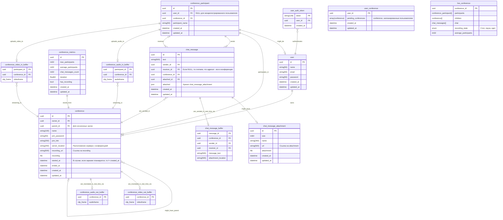
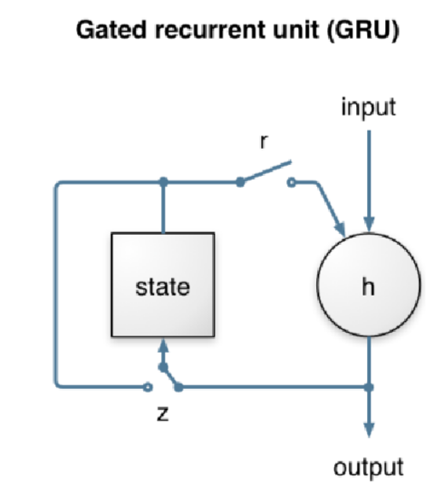
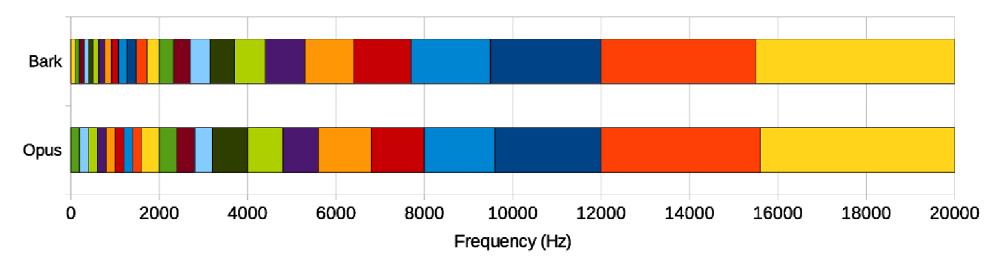
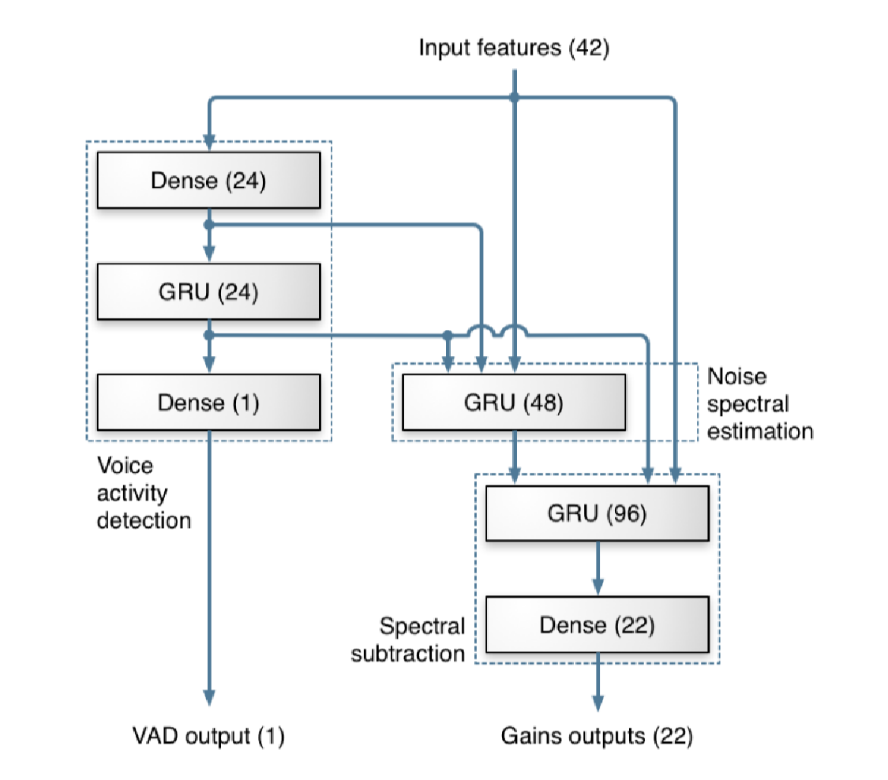

# Проектирование высоконагруженных систем. Zoom

Данный файл предназначен для документирования работы и принятых решений
в рамках курса проектирования высоконагруженных систем.

<!-- mtoc-start -->

* [1. Тема и целевая аудитория](#1-тема-и-целевая-аудитория)
  * [Продукт](#продукт)
  * [Функционал MVP](#функционал-mvp)
    * [Ключевые продуктовые решения](#ключевые-продуктовые-решения)
  * [Анализ целевой аудитории](#анализ-целевой-аудитории)
    * [Методологии оценки](#методологии-оценки)
      * [Monthly Active Users](#monthly-active-users)
      * [Распределение пользователей по миру](#распределение-пользователей-по-миру)
    * [Готовые цифры](#готовые-цифры)
    * [География пользователей](#география-пользователей)
* [2. Расчет нагрузки](#2-расчет-нагрузки)
  * [Продуктовые метрики](#продуктовые-метрики)
    * [Расчет средних значений](#расчет-средних-значений)
    * [Сводная таблица](#сводная-таблица)
  * [Технические метрики](#технические-метрики)
    * [Расчет размеров хранения медиафайлов](#расчет-размеров-хранения-медиафайлов)
    * [Расчет сетевого трафика](#расчет-сетевого-трафика)
    * [Расчет RPS](#расчет-rps)
* [3. Глобальная балансировка нагрузки](#3-глобальная-балансировка-нагрузки)
  * [Выбор и схема балансировки](#выбор-и-схема-балансировки)
  * [Разделение RPS по датацентрам](#разделение-rps-по-датацентрам)
* [4. Локальная балансировка нагрузки](#4-локальная-балансировка-нагрузки)
  * [Схема балансировки внешних запросов](#схема-балансировки-внешних-запросов)
  * [Схема балансировки межсервисных запросов](#схема-балансировки-межсервисных-запросов)
  * [Схема отказоустойчивости](#схема-отказоустойчивости)
  * [Терминация SSL](#терминация-ssl)
* [5. Логическая схема БД](#5-логическая-схема-бд)
  * [Описание сущностей](#описание-сущностей)
  * [Нагрузка на сущности](#нагрузка-на-сущности)
  * [Особенности поддержания консистентности сущностей](#особенности-поддержания-консистентности-сущностей)
* [6. Физическая схема БД](#6-физическая-схема-бд)
  * [Схема резервного копирования](#схема-резервного-копирования)
* [7. Алгоритмы](#7-алгоритмы)
  * [Запись видеоконференции](#запись-видеоконференции)
    * [Наивная реализация](#наивная-реализация)
    * [Алгоритм на основе чанков](#алгоритм-на-основе-чанков)
  * [Шумоподавление в разговоре](#шумоподавление-в-разговоре)
* [8. Технологии](#8-технологии)
  * [Общие](#общие)
  * [Frontend](#frontend)
    * [Web](#web)
    * [Десктоп](#десктоп)
    * [Мобильные приложения](#мобильные-приложения)
  * [Backend](#backend)
    * [Протоколы передачи данных](#протоколы-передачи-данных)
    * [Шифрование и хеширование](#шифрование-и-хеширование)
    * [Наблюдаемость](#наблюдаемость)
    * [Языки программирования](#языки-программирования)
    * [Технологии обработки медиа](#технологии-обработки-медиа)
  * [DevOps](#devops)
  * [Данные](#данные)
* [9. Схема проекта](#9-схема-проекта)
* [10. Обеспечение надежности](#10-обеспечение-надежности)
* [11. Аппаратные ресурсы](#11-аппаратные-ресурсы)
  * [Расчет ресурсов по сервисам](#расчет-ресурсов-по-сервисам)
  * [Таблица для сервисов под оркестрацией kubernetes](#таблица-для-сервисов-под-оркестрацией-kubernetes)
  * [Выбор железа](#выбор-железа)
  * [Расчет стоимости и амортизации](#расчет-стоимости-и-амортизации)
* [Список источников](#список-источников)

<!-- mtoc-end -->

## 1. Тема и целевая аудитория

### Продукт

Zoom - это платформа для проведения видеоконференций, которая в настоящее время
позиционирует себя как "рабочее место", включающее в себя коллективный чат,
доски, заметки, почтовый клиент, работу с документами и так далее.
Продукт приобрел широкую популярность благодаря пандемии и с тех пор занимает
лидирующее место среди аналогов.

Основной способ монетизации - разного рода подписки.

### Функционал MVP

* Регистрация и авторизация
* Создание конференции и подключение к ней
* Отдельные комнаты в рамках одной конференции (сессионные залы в терминах zoom)
* Запись конференции
* Чат в конференции (с возможностью прикладывать файлы)

#### Ключевые продуктовые решения

* Подключение к конференции не требует регистрации (по ссылке или id и паролю)
* Запись конференции происходит на стороне сервиса  
  (но возможна и локальная, её проектировать не будем)
* Чат также записывается при записи конференции

### Анализ целевой аудитории

Сразу обозначим, что вся доступная информация касательно аудитории zoom
приводится в открытых источниках только на момент разгара пандемии
(до 2021 года). Поэтому на самом деле мы будем проектировать zoom образца 2020 года.

#### Методологии оценки

В данном разделе описано, как рассчитаны показатели, явно отсутствующие в источниках.

##### Monthly Active Users

Zoom ни разу не публиковал данную метрику в открытый доступ, поэтому остается только
лишь её оценивать по другим показателям.
Казалось бы, можно было бы использовать статистику по уникальным посетителям
веб-сайта zoom.us [1]. Отметим несколько фактов, которые ответят нам на
вопрос "Можно ли?":

1. Подключение к конференции возможно по ссылке и по логину с паролем. В
   случае подключения по ссылке человек проходит через сайт zoom.us, однако
   только если он пользуется десктопной версией.
2. У zoom есть веб-клиент, а потому пользователи веб-клиента также
   считаются в эту метрику.

Таким образом, строго опираться на данную метрику нельзя, так как

* Не учитываются пользователи мобильных приложений;
* Не учитываются пользователи, подключающиеся не по ссылке.
* Учитываются боты и другие пользователи, не относящиеся к категории активных

Далее, приведем косвенную оценку MAU на конец 2020 года (4-й квартал).
Для данного периода нам известно

* Среднее время конференции (T): 54 минуты  [2]
* Среднее число человек, участвующих в конференции (n): 10  [2]
* Ожидаемое годовое число минут конференций ($t_{total}$): 3.3 триллиона минут.
   (zoom рассчитал эту метрику, умножив суммарное число минут конференций
   за декабрь 2020 на 12). [3]

Пусть число конференций, проведенных месяц, будет равно $N_{сум}$.
Тогда

$N_{сум} = \frac{t_{total}}{12T} = \frac{101 \cdot 10^{9}}{12 \cdot 54} \approx 155864197.5 \approx 156$ ($млн.)

В худшем случае, каждая из этих конференций содержала уникальных людей. С учетом
средней численности человек в конференции, оценкой сверху для MAU является

$\textit{MAU}_{max} = n * N = 10 \cdot 156 = 1.6 (млрд. чел)$

Итого мы получили крайне завышенное значение, которое нельзя использовать для расчета.

Придем к последнему варианту оценки. Возьмем в качестве оценки MAU
значение, которое публикует конкурент для своего продукта относительно
объема рынка, которое он занимает.
Так, Microsoft Teams заявляет 320 млн. MAU [4] на начало 2024 года.
Кроме того, zoom занимает 55.91% рынка, а Teams - 32.29% [5]. Значит
можно полагать, что

$\textit{MAU} \approx 320\cdot\frac{55.91}{32.29} \approx 554$ (млн.)

Отметим, что данное значение помещается в пределы оценки и выше
DAU (300 млн.) [6], значит можем использовать.

##### Распределение пользователей по миру

Для оценки этого параметра можем считать, что распределение пользователей,
которые генерируют трафик на zoom.us и пользователей, которые входят
в активную аудиторию совпадают.
Также был проверен и трафик других доменов zoom, но на них распределение
приблизителльно совпадало.

#### Готовые цифры

* 300 млн. Daily Active Users [6] (на 2020 год, но других данных нет)
* 554 млн. Monthly Active Users*

\*показатель получен косвенным путем

#### География пользователей

| Страна         | %     | MAU, млн. | DAU, млн. |
|----------------|-------|-----------|-----------|
| США            | 43.83 | 242.8     | 131.5     |
| Япония         | 7.74  | 42.9      | 23.2      |
| Индия          | 4.22  | 23.4      | 12.7      |
| Канада         | 3.94  | 21.8      | 11.8      |
| Великобритания | 3.74  | 20.7      | 11.2      |
| Остальные      | 36.53 | 202.4     | 109.6     |

## 2. Расчет нагрузки

### Продуктовые метрики

#### Расчет средних значений

Число регистраций можно оценить по отчету прибыли [7].
Сначала оценим долю MAU, которую составляют платные пользователи. Это
можно сделать, поделив выручку компании на цену платной подписки (\$12.5) [8].

$\textit{MAU}_\text{плат} \approx \frac{1146}{12.5} = 91.68$ (млн. чел)

Примем, что прирост платных пользователей для короткого срока (месяц-два)
имеет прямую пропорциональную зависимость с приростом всех пользователей, что
и означает регистрация. Тогда имеет место соотношение для числа регистраций в
месяц

$R=\Delta\textit{MAU}_\text{плат}\frac{\textit{MAU}}{\textit{MAU}_\text{плат}}$

$R \approx\frac{1146 - 1118}{12.5}\cdot\frac{554.00}{91.68}\approx 13.54$ (млн.)

Усредняя это число для суточного периода, имеем

$R_\text{ср. дн} = \frac{13.54}{30} \approx 0.451$ (млн.)

Для числа авторизаций проведем оценку сверху. Для этого
допустим, что все пользователи zoom авторизуются (в том
числе и те, кто анонимно заходит в конференцию).
Кроме того, допустим также, что пользователи заходят в
zoom каждый рабочий день (5 дней в неделю и 20 в месяц).

Кроме того, отметим мои собственные наблюдения:

* Для авторизаций на сайте zoom создает сессионную куку,
которая уничтожается при перезаходе в браузер (время жизни session).
* При каждом входе в приложение zoom обновляет авторизацию, будь то
авторизация по его собственным механизмам или же с помощью oauth.

Итого будем считать за авторизацию каждый заход в приложение или
на сайт в рамках браузерной сессии. Тогда за месяц в среднем
человек будет заходить в zoom 20 раз (по раз за рабочий день).
Итого будем иметь среднее число авторизаций за месяц

$A = 20 \cdot MAU = 11080 = 11.08$ (млрд. в мес).  
$A_\text{ср. дн} = \frac{A}{30} = \frac{11080}{30} \approx 369$ (млн. в день)

Число созданий конференций можно оценить по самому числу
конференций. Уже известно, что
среднее число конференций в месяц равно 156 млн. Тогда в день имеем

$N_\text{ср. дн} = \frac{156}{30} \approx 5.2$ (млн.)

Учитывая среднее число участников конференций (10 человек), среднее
число участий будет равно

$5.2 \cdot 10 = 52$ (млн.)

Примем, что каждая третья конференция Zoom записывается.
Тогда среднее число записей будет равно

$5.2 / 3 = 1.73$ (млн.)

Примем, что каждый пользователь в среднем оставляет 10 сообщений в чате.
При этом 10% сообщений прикладывают файл.
Тогда среднее число сообщений в чате равно

$52 \cdot 10 = 520$ (млн.),

а среднее число файлов в чате

$520 \cdot 0.1 = 52$ (млн.)

Пусть только 10% конференций содержат сессионные залы.
При этом в среднем их будет 3. Тогда  
Среднее число созданий сессионного зала  $5.2 \cdot 0.1 \cdot 3 = 1.56$ млн.  
Среднее число участий в сессионном зале  $52 \cdot 0.1 \cdot 3 = 15.6$ млн.  
Среднее число записей сессионного зала  $1.73 \cdot 0.1 \cdot 3 = 0.519$ млн.

Средний размер хранилища пользователя складывается из
среднего объема записей конференций и медиафайлов в чате.
Его оценка приведена в разделе с техническими метриками.

#### Сводная таблица

| Метрика | млн. пользователей |
|---------|--------------------|
| DAU     | 300                |
| MAU     | 554                |

Средний размер хранилища пользователя: 1.15 ГБ. (Расчет для него приведен далее).

| Действие пользователя    | Среднее количество в сутки, шт. |
|--------------------------|---------------------------------|
| Регистрация              |         0.451 млн.              |
| Авторизация              |         369 млн.                |
| Создание конференции     |         5.2 млн.                |
| Участие в конференции    |         52 млн.                 |
| Запись конференции       |        1.73 млн.                |
| Сообщение в чате         |        520 млн.                 |
| Файл в чате              |        52 млн.                  |
| Создание сессионного зала|        1.56 млн.                |
| Участие в сессионном зале|        15.6 млн.                |
| Запись сессионного зала  |        0.519 млн.               |

\* В сущности числа для сессионых залов необязательны, так как сессионный зал является
подвидом конференции.  

### Технические метрики

#### Расчет размеров хранения медиафайлов

Произведем расчет для медиафайлов. Начнем с самого простого - размера файла.
Известно, что в Zoom максимальный размер файла, который можно прикрепить,
равен 1 Гб [9]. Однако далеко не все люди прикрепляют
такие файлы. Поэтому примем, что средний размер файла 10 Мб.

Далее, расчитаем размер записи конференции. Считать будем исходя из того,
что Zoom умеет передавать видео в формате FullHD 1080p [10].

Также отметим особенности Zoom. На записи он показывает только один экран
одновременно. Кроме того, Zoom также
предоставляет записи в формате mp4. Примем, исходя из данных [11] о битрейте, что
в записи хранится картинка максимального качества с битрейтом 3.8 Мбит/c. Тогда
средняя конференция Zoom (54 минуты) занимает

$V = 3.8 \cdot 60 \cdot 54  = 12$ (Гбайт.)

Для размера потока живой конференции мы также можем взять данные Zoom, а именно
битрейт для групповых звонков 3.8 Мбит/с. (Это битрейт для максимального качества
конференции. Но так как мы занимаемся проектированием, то разумно брать запасы).

С учетом того что сессионные залы это тоже конференции, расчет для них не отличается.

Отсюда мы можем получить средний объем хранилища пользователя как суммарное число
записанных конференций плюс суммарное число файлов, приходящихся на одного пользователя.

$V_\text{пол. ср} = \frac{30}{MAU} \left[ V N_\text{зап. сут} + V_\text{файл. ср} N_\text{файл. сут.} \right]$

$V_\text{пол. ср} = \frac{30}{554 \cdot 10^6} \left[ 12 \cdot 1.73 \cdot 10^6 + 10 / 1024 \cdot 52 \cdot 10^6 \right] \approx 1.15$ (Гбайт)

#### Расчет сетевого трафика

Основной трафик, который генерируется в рамках zoom, генерируется за счет
конференций. А потому, расчет
нужен только для видео и файлов.

Для видео уже посчитали битрейт 3.8 Мбит/с на конференцию,
а также средний размер конференции 12 Гбайт.
С учетом их количества, имеем

$12 \cdot 1.73\approx 20.76$ (млн. Гбайт. в сутки)

Для файлов аналогично найдем

$10 / 1024 \cdot 52 \approx 0.51$ (млн. Гбайт в сутки)

Для подсчета пиковых значений было проведено следующее исследование:

* Был проведен поиск статистики по дневному трафику zoom
* Был проведен поиск статистики по дневному трафику аналогов zoom
* Был проведен поиск графиков дневного трафика на технических конференциях

Ни один из обозначенных выше способов не дал результата, поэтому для подсчета
пикового RTS возьмем график трафика через один из internet exchange. Это
можно использовать для оценки, так как

* Графики локального трафика приблизительно имеют одну и ту же форму
* Около половины аудитории zoom расположены в США и США обладает достаточно
  близкими часовыми поясами (максимальная разница во времени 6 часов), что
  подойдет для оценки.

Для расчета возьмем форму графика трафика, которым поделился SeattleIX [12].

Далее, берем период с 22:00 до 22:00 следующего дня, интегрируем его и делим на 24
часа. Получим среднее значение для трафика для SIX. Далее, с помощью пропорции получаем
отношение пикового трафика к среднему. И это отношение используем для расчета пикового
RPS и сетевого трафика.

Для SIX средний трафик приведен на картинке и равен 2.54 Тб. Причем его максимальное
значение
равно 3.38 Тб. Таким образом, коэффициент перегрузки трафика равен

$K = \frac{3.38}{2.54} \approx 1.33$

Подобные графики были просмотрены и для других IX. Для запаса берем коэффициент
перегрузки 1.5.

Теперь посчитаем пиковый трафик для медиафайлов. Для этого сначала считаем
среднесуточный трафик, а затем умножаем его на коэффициент перегрузки.

Для видеопотоков получается

* Средний $20.76 \cdot 10^6 / 24 / 60 / 60 \approx 240$ (Гбайт в сек)
* Пиковый $240 \cdot 1.5 = 360 = 2880$ (Гбит в сек)

Для файлов в чате

* Средний $0.51 \cdot 10^6 / 24 / 60 / 60 \approx 6$ (Гбайт в сек)
* Пиковый $6 \cdot 1.5 = 72$ (Гбит в сек)

#### Расчет RPS

Средний RPS был посчитан из продуктовых метрик в расчете не секунду по
формуле

$RPS = \frac{M_\text{ср}}{24 \cdot 60 \cdot 60}$,

где M - среднее значение метрики за сутки.

Пиковый же RPS получен из среднего при помощи коэффициента, рассчитанного
ранее.

| Действие пользователя    | Средний RPS  | Пиковый RPS |
|--------------------------|--------------|-------------|
| Регистрация              |        5.22  |       7.83  |
| Авторизация              |        4270  |       6405  |
| Создание конференции     |        60    |       90    |
| Участие в конференции    |        600   |       900   |
| Запись конференции       |        20    |       30    |
| Сообщение в чате         |        6018  |       9027  |
| Файл в чате              |        602   |       903   |
| Создание сессионного зала|        18    |       27    |
| Участие в сессионном зале|        180   |       270   |
| Запись сессионного зала  |        6     |       9     |

## 3. Глобальная балансировка нагрузки

### Выбор и схема балансировки

В качестве метода балансировки нагрузки выберем DNS балансировку
нагрузки. Выбор связан с тем, что наша целевая аудитория широко
распространена по Земле и использование BGP Anycast было бы
затруднительно, так как оно требует наличие автономной системы
мировых размеров.

Среди типов DNS балансировки нам может подойти Geo-based DNS или
Latency-based DNS. Остановим свой выбор на последнем, так как
задержка для сервиса является более важным критерием. Кроме того,
можно руководствоваться следующими доводами:

* Сервер, транслирующий пользователям видеоконференцию, и получающий
  от них потоки, один (с возможностью замены) и является
  stateful-приложением.
* Если пользователи располагаются географически рядом (в пределах города),
  то вероятнее всего их распределит на одинаковый датацентр (для любого из
  приведенных выше способов балансировки)
* Если пользователи располагаются далеко друг от друга географически, то
  достоинства обоих DNS-балансировщиков нивелируются.

Исходя из вышеуказанного, Latency-based DNS будет лучшим выбором.

Остается лишь распределить датацентры по миру согласно нашей аудитории.
Напомним, что пропорции мировой аудитории распределены следующим образом:

* США 43.83%
* Япония 7.74%
* Индия 4.22%
* Канада 3.84%
* Великобритания 3.74%
* Остальной мир 36.53%

Таким образом, из анализа этих процентов, следует разместить по паре
датацентров в США на разных географических точках. Они будут обслуживать
клиентов из США и Канады. Также нужна пара датацентров в Японии, Европе
(один из которых нужен в Лондоне) и Индии.

Каждая пара из близко-расположенных датацентров
(по регионам, регионы обозначены ниже) балансируется после DNS балансировки
при помощи BGP Anycast. Это уже становится возможным, так как размеры
получившейся автономной системы уже куда более скромны.

**Примечание на будущее**. Подключающийся к конференции пользователь отправляет запрос на конкретный
медиасервер, на котором эта конференция и хостится. В этом случае эффекты от DNS и BGP Anycast балансировки
по пользователям нам будут мешать, так как балансировка проходит по конференциям, а не по отдельным юзерам.
Обсудим, как обойти DNS и BGP Anycast балансировку для этого случая:

* Для обхода DNS балансировки будем использовать поддомены по
  зонам доступности. К примеру, ссылка для подключения
  к конференции в Европе будет иметь домен eu.zoom.us/...
* Для обхода BGP Anycast балансировки выделим под медиасервера
  отдельный IP адрес, который не будем балансировать
  через BGP.

Итого, выбираем следующие датацентры [13]:

* Северная Виржиния (Восток США), 12.48% аудитории
* Огайо (Восток США), 12.48% аудитории
* Орегон (Запад США), 12.48% аудитории
* Северная Калифорния (Запад США), 12.48% аудитории
* Лондон (Западная Европа) 15.91% аудитории
* Франкфурт (Западная Европа) 12.17% аудитории
* Осака (Япония) 3.87% аудитории
* Токио (Япония) 3.87% аудитории
* Хайдарабад (Индия) 2.11% аудитории
* Мумбаи (Индия) 2.11% аудитории

На будущее сервиса стоит также задуматься о строительстве датацентров в
других мировых регионах, к примеру в Южной Америке и Восточной Европе. Мы не
стали их располагать, так как мало информации о том, какая часть из аудитории
остального мира находится в этих регионах.

Расчет распределения аудитории произведен на основании допущения,
что жители одного региона (указан в скобках) равномерно обращаются
к датацентрам (естественно, это не так, но других данных нет). Кроме того, мы считаем,
что жители Канады идут в датацентры США, а также что остальной мир на
2/3 это жители Европы, а оставшаяся треть равномерно уходит во все датацентры.

### Разделение RPS по датацентрам

Ячейки имеют формат (средний RPS, пиковый RPS)

| Запрос                   | Сев. Вирджиния, Огайо, Орегон и Сев. Калифорния | Лондон       | Франкфурт    | Осака и Токио | Хайдабарад и Мумбаи |
|--------------------------|-------------------------------------------------|--------------|--------------|---------------|---------------------|
| Регистрация              | 0.7/1.0                                         | 0.8/1.2      | 0.6/0.9      | 0.2/0.3       | 0.1/0.2             |
| Авторизация              | 532.9/800.0                                     | 679.4/1019.1 | 519.7/779.6  | 165.2/247.8   | 90.1/135.2          |
| Создание конференции     | 7.5/11.3                                        | 9.5/14.3     | 7.3/11.0     | 2.3/3.6       | 1.3/2.0             |
| Участие в конференции    | 74.8/112.2                                      | 95.5/143.3   | 73.0/109.5   | 23.2/34.8     | 12.7/19.1           |
| Запись конференции       | 2.5/3.8                                         | 3.2/4.8      | 2.4/3.6      | 0.8/1.2       | 0.4/0.6             |
| Сообщение в чате         | 751/1126.5                                      | 957.5/1436.3 | 732.4/1098.6 | 232.9/349.4   | 127.0/191.0         |
| Файл в чате              | 75/112.5                                        | 95.8/143.7   | 73.3/110.0   | 23.3/35.0     | 12.7/19.1           |
| Создание сессионного зала| 2.3/3.4                                         | 2.9/4.4      | 2.2/3.3      | 0.7/1.1       | 0.4/0.6             |
| Участие в сессионном зале| 22.5/33.8                                       | 28.6/42.9    | 21.9/32.85   | 7.0/11.0      | 3.8/5.7             |
| Запись сессионного зала  | 0.8/1.1                                         | 1.0/1.5      | 0.7/1.1      | 0.2/0.3       | 0.1/0.2             |

## 4. Локальная балансировка нагрузки

### Схема балансировки внешних запросов

На входе в датацентр применяется технология Linux Virtual Server via Direct Routing.
Балансировщик работает на уровне L3 OSI и подменяет MAC адрес устройства, к которому
идет соединение. Мы можем себе это позволить, так как первичный этап балансировки
имеет достаточно мало узлов, которые мы можем без проблем соединить
в одну физическую сеть.

Далее, запрос маршрутизируется на один из нескольких L7-балансировщиков (Nginx).
Nginx анализирует запрос и разделяет его в зависимости от того, что пользователю
нужно: статика, веб-сайт или конференции.

В случае, если запрос идет не за статикой, он переходит в кластер k8s. В кластере
стоит уже свой ingress-nginx, распределяющий нагрузку по сервисам. В этом же месте
происходит терминация SSL.

Также для реализации звонков потребуется балансировка на уровне приложения. Если
запрос направлен на URL звонка, то возможна ситуация, когда пользователь придет
не в тот ЦОД и его необходимо отправить в другой. Для этого будет использована
балансировка при помощи специального сервера (сервис бэкенда), который
будет по ID конференции выдавать IP-адрес сервера конференции,
куда нужно подключаться к звонку.

### Схема балансировки межсервисных запросов

Межсервисное взаимодействие строится при помощи sidecar proxy, реализуемого
при помощи k8s.

Межсервисного взаимодействия для медиасервера не предусматривается.

### Схема отказоустойчивости

* Защита от падения L3 балансировщика не предусматривается, так как решается
  на этапе глобальной балансировки. Сама же вероятность падения аппаратного
  обеспечения на этом уровне ничтожна.

* Защита от падения L7 балансировщика - используем схему основной-запасной.
  Будем иметь 2 сервера, которые имеют один и тот же IP, причем у одного
  этот IP на виртуальном интерфейсе, а у другого - на физическом.
  Таким образом, если умрет Nginx на физическом интерфейсе,
  то Nginx на виртуальном подхватит.

* Отказоустойчивость бэкендов реализуется k8s кластером. Если какой-либо
  сервис вышел из строя, внешний балансировщик повторит запрос. При этом
  упавший сервис начнет перезапуск.

### Терминация SSL
  
Терминацию SSL необходимо производить на входе в k8s кластер. Раньше
нельзя, так как запрос может быть направлен не на бэкенд, а в хранилище
статики.

## 5. Логическая схема БД

*Примечание 1*. Названия типов приведены условно, так как они зависят от выбора
конкретной СУБД.

*Примечание 2*. Для live_conference связи не указаны,
чтобы сохранить читаемость схемы.

*Примечание 3* Здесь обозначены не связи между данными в сущностях, а
связи между самими сущностями. Так, например, очевидно, что в
выходные и входные буферы пишется видеопоток, а не данные
о конференциях.

*Примечание 4* Файлы не хранятся напрямую в таблицах с ними,
но приведены, чтобы не загроможать схему. Хранение файлов обеспечивается объектным
хранилищем.

*Примечание 5* Схема уже в некоторой степени является денормализованной. Так,
сущности chat и conference со связью 1к1 соединены для минимизации join операций.

### Описание сущностей

| Сущность                    | Назначение                                            | Размер               |
|-----------------------------|-------------------------------------------------------|----------------------|
| chat_message                | Хранение сообщений чата                               | (596 ... 1396) байт  |
| chat_message_attachment     | Хранение прикреплений сообщений                       | 800 байт + 10 Мбайт  |
| conference                  | Хранение горячих данных о конференции                 | 1230 байт + 12 Гбайт |
| conference_metrics          | Хранение холодных метрик конференции                  | 53 байт              |
| conference_participant      | Хранение участников конференции                       | 114 байт             |
| user_auth_token             | Хранение авторизационного токена пользователя         | 144 байт             |
| user                        | Хранение зарегистрированного пользователя             | 174 байт             |
| user_conference             | Хранение агрегированной информации о конференциях юзера| >= 48 байт          |
| chat_message_buffer         | Асинхронная очередь для отправки сообщений            | 1064 байт            |
| conference_video_out_buffer | Часть буфера сокета UDP-соединения для отправки видео | 3.8 Мбит             |
| conference_audio_out_buffer | Часть буфера сокета UDP-соединения для отправки аудио |  ~8 Кбайт            |
| conference_video_in_buffer  | Часть буфера сокета UDP-соединения для приема видео   | 3.8 Мбит             |
| conference_audio_in_buffer  | Часть буфера сокета UDP-соединения для приема аудио   | ~ 8 Кбайт            |
| live_conference             | Хранение состояния активной конференции               | ~ 4 КБайт            |

*Примечание:*

Все размеры рассчитаны исходя из размеров структур данных на ER-диаграме.
Для буферов выбран размер одного кадра. Для структур с ~ взято среднее значение
для размера массивов.

* "~" означает приблизительно и может варьироваться
* "..." указывает на точный диапазон
* ">=" является оценкой снизу

### Нагрузка на сущности

*Примечание 1.* Все расчеты QPS указаны без учета кэширования, буферизации и
иных способов снятия нагрузки на чтение и запись.

Для начала обозначим, за счет чего образуется нагрузка на сущностях:

1. chat_message:
    * На чтение:
      1. Прочтение сообщения (90270 RPS)
      2. Сборка записи чата ($\approx$ 0 RPS по сравнению с верхним значением)
    * На запись:
      1. Отправка сообщения (9027 RPS)
2. chat_message_attachment:
    * На чтение:
      1. Прочтение сообщения с файлом (9030 RPS)
    * На запись
      1. Отправка сообщения с файлом (903 RPS)
3. conference
    * На чтение:
      1. Подключение к конференции (2x1170=2340 RPS, с запасом на переподключения)
      2. Скачивание записи конференции (0, на пару порядков ниже верхнего значения)
    * На запись:
      1. Создание/Планирование конференции (117 RPS)
      2. Запись ссылки на рендер записи (117 RPS)
      3. Начало конференции (117 RPS)
      4. Завершение конференции (117 RPS)
4. conference_metrics
    * На чтение:
      1. Различные аналитические запросы. Тяжелые, но маленькие запросы (??? RPS)
    * На запись:
      1. Завершение конференции (107 RPS)
5. conference_participant
    * На чтение:
      1. Сборка записи чата (1170 RPS)
    * На запись:
      1. Человек входит в конференцию (2340 RPS)
      2. Человек меняет имя в конференции (234 RPS)
6. user_auth_token
    * На чтение:
      1. Подключение к конференции (2340 RPS)
      2. Создание конференции (117 RPS)
      3. Смена имени в конференции (234 RPS)
      4. Начало записи конференции (39 RPS)
      5. Окончание записи (39 RPS)
      6. Выход из конференции (2340 RPS)
      7. Отправка сообщения в чат (9027 RPS)
      8. Прочтение сообщения из чата (90270 RPS)
    * На запись:
      1. Авторизация (6405 RPS)
      2. Регистрация (8 RPS)
7. user
    * На чтение:
      1. Подключение к конференции (2340 RPS)
      2. Авторизация (6405 RPS)
    * На запись:
      1. Создание конференции (117 RPS)
      2. Регистрация (8 RPS)
8. user_conference
    * На чтение:
      1. Запрос конференций пользователя (117 RPS)
    * На запись:
      1. Создание и обновление статуса конференции (117 RPS)
9. chat_message_buffer
    * На чтение:
      1. Прочтение сообщения (90270 RPS)
    * На запись:
      1. Отправка сообщения (9027 RPS)
10. conference_video_out_buffer
    * На чтение:
      1. Просмотр конференции (10000 RPS)
    * На запись:
      1. Генерация кадра конференции (1000 RPS)
11. conference_audio_out_buffer
    * На чтение:
      1. Просмотр конференции (10000 RPS)
    * На запись:
      1. Генерация кадра конференции (1000 RPS)
12. conference_video_in_buffer
    * На чтение:
      1. Генерация кадра конференции (10000 RPS)
    * На запись:
      1. Отправка кадра конференции (10000 RPS)
13. conference_audio_in_buffer
    * На чтение:
      1. Генерация кадра конференции (10000 RPS)
    * На запись:
      1. Отправка кадра конференции (10000 RPS)
14. live_conference
    * На чтение:
      1. Вход в конференцию (2340 RPS)
      2. Просмотр сообщения из чата (90270 RPS)
    * На запись:
      1. Вход в конференцию (2340 RPS)
      2. Выход из конференции (2340 RPS)
      3. Отправка сообщения в чат (9027 RPS)
      4. Начало записи (39 RPS)
      5. Окончание записи (39 RPS)
      6. Смена имени в конференции (234 RPS)

| Сущность                    | RPS чтение | RPS запись |
|-----------------------------|------------|------------|
| chat_message                | 90270      | 9027       |
| chat_message_attachment     | 9030       | 903        |
| conference                  | 2340       | 468        |
| conference_metrics          | 0 (мало)   | 107        |
| conference_participant      | 1170       | 2574       |
| user_auth_token             | 104406     | 6413       |
| user                        | 8745       | 125        |
| user_conference             | 117        | 117        |
| chat_message_buffer         | 90270      | 9027       |
| conference_video_out_buffer | 10000      | 1000       |
| conference_audio_out_buffer | 10000      | 1000       |
| conference_video_in_buffer  | 10000      | 10000      |
| conference_audio_in_buffer  | 10000      | 10000      |
| live_conference             | 92610      | 14019      |

### Особенности поддержания консистентности сущностей

1. chat_message  
Для минимизации join операций он хранит в себе копию chat_message_attachment.
Поэтому при изменении исходника, нужно поменять и эту копию.

2. chat_message_attachment  
Особых требований нет.

3. conference  
Особых требований нет.

4. conference_metrics  
chat_messages_count - поле, которое можно рассчитать
при помощи таблицы chat_message. Кроме того, max_participants
можно рассчитать из таблицы conference_participant, duration и has_recording -
из таблицы conference. Поле average_participants фиксирует последнее состояние
поля average_participants из live_conference.

5. conference_participant  
Для участников конференции, являющихся зарегистрированными пользователями,
начальное значение participant_name должно совпадать с полем name
в таблице user.

6. user_auth_token  
Особых требований нет.

7. user_conference  
Поле pending_conferences является производным и рассчитывается из
таблицы conference по дате и user_id.

8. chat_message_buffer  
Вся информация в буфере дублирует аналогичные поля из таблицы
chat_message.

9. conference_video_out_buffer  
Особых требований нет.

10. conference_audio_out_buffer  
Особых требований нет.

11. conference_video_in_buffer  
Особых требований нет.

12. conference_audio_in_buffer  
Особых требований нет.

13. live_conference
Вся информация является первичной по отношению к аналогичным полям из остальных
таблиц. Непроизводными полями являются recording_state и average_participant.

## 6. Физическая схема БД

Для удобства продублируем логическую схему без комментариев по сущностям. Будем
следовать следующим правилам:

* Комментарий для первого атрибута указывает на СУБД, в которой будем хранить сущность.
  Очевидно, что для всех первичных ключей автоматически формируется индекс.
* Для сущностей с файлами в строке с файлом указано, как хранится файл
* Комментарии к другим полям описывают индекс (при наличии). Если индекса
  нет, то может быть описан шардинг
* Так как денормализация произведена ранее, не будем её снова описывать

```mermaid
erDiagram

  chat_message {
    uuid id PK "MongoDB"
    string(500) text "Шардинг по conference_id"
    uuid sender_id
    uuid receiver_id
    uuid conference_id "BTree индекс"
    uuid attached_id
    json attached
    datetime created_at
    datetime updated_at
  }

  chat_message_attachment {
    uuid id PK "MongoDB"
    int64 size "Шардинг по conference_id (часть chat_message)"
    string(260) name
    string(500) url
    file attachment "Ceph S3"
    datetime created_at
    datetime updated_at
  }

  conference {
    uuid id PK "PostgreSQL"
    uuid owner_id "BTree индекс"
    uuid parent_id "Hash индекс (малое количество строк с одним хэшом)"
    string(100) name "Шардинг по id"
    string(50) join_password
    string(250) join_link "BTree индекс"
    string(250) server_location
    string(500) recording_url
    file recording "Ceph S3"
    datetime started_at
    datetime ended_at
    datetime created_at
    datetime updated_at
  }

  conference_metrics {
    uuid id "ClickHouse"
    int32 max_participants
    int32 average_participants
    int32 chat_messages_count
    float64 duration
    bool has_recording
    datetime created_at "BTree индекс"
    datetime updated_at
  }

  conference_participant {
    uuid id "PostgreSQL"
    uuid user_id "Шардинг по conference_id"
    uuid conference_id "BTree индекс"
    string(50) participant_name
    datetime created_at
    datetime updated_at
  }

  user_auth_token {
    string(128) token "Redis"
    uuid user_id "Шардинг по token"
    datetime created_at
  }

  user {
    uuid id "PostgreSQL"
    string(50) name "Шардинг по id"
    string(50) email "Hash индекс"
    string(50) password
    array(conference) pending_conferences
    datetime created_at
    datetime updated_at
  }

  user_conference {
    uuid user_id "PostgreSQL"
    array(conference) pending_conferences
    datetime created_at
    datetime updated_at
  }

  chat_message_buffer {
    uuid message_id "Kafka"
    uuid conference_id "Автоматическое партиционирование"
    uuid sender_id
    uuid receiver_id
    string(500) message_text
    string(500) attachment_location
  }

conference_video_out_buffer {
    uuid conference_id "in-memory"
    rdp_frame videoframe "Шардинг автоматически за счет медиасервера"
  }

conference_audio_out_buffer {
    uuid conference_id "in-memory"
    rdp_frame audioframe "Шардинг автоматически за счет медиасервера"
  }

conference_audio_in_buffer {
    uuid participant_id "in-memory"
    uuid conference_id
    rdp_frame audioframe "Шардинг автоматически за счет медиасервера"
  }

conference_video_in_buffer {
    uuid participant_id "in-memory"
    uuid conference_id
    rdp_frame videoframe "Шардинг автоматически за счет медиасервера"
  }

  live_conference {
    uuid conference_id "in-memory"
    conference_participant[] participants
    conference[] children
    chat_messages[] chat
    enum recording_state "Стоп, пауза, идет"
    int32 average_participants "Шардинг автоматически за счет медиасервера"
  }

  conference_participant ||--o| user : might_be
  conference_participant ||--o| conference : participates_in
  conference_metrics ||--|| conference : stored_from

  user ||--|{ conference : owns

  user_auth_token }o--|| user : authenticates

  conference }o--o| conference : might_have_parent

  chat_message ||--o| chat_message_attachment: might_have
  conference_participant ||--|{ chat_message : sends
  conference_participant |o--|{ chat_message : receives

  chat_message ||--o| chat_message_buffer : are_sended_in_real_time_via

  conference ||--o| conference_video_out_buffer : are_translated_in_real_time_via
  conference ||--o| conference_audio_out_buffer : are_translated_in_real_time_via
  conference_video_in_buffer }o--|| conference : streaming_in 
  conference_audio_in_buffer }o--|| conference : streaming_in 
  conference_participant ||--o| conference_audio_in_buffer : uploads_audio_to
  conference_participant ||--o| conference_video_in_buffer : uploads_video_to

  chat_message }o--|| conference : are_sended_in

```

### Схема резервного копирования

* PostgreSQL: останавливаем реплику, снимаем с неё данные, включаем обратно.
* MongoDB: снимаем снапшоты файловой системы при помощи LVM.
* Kafka: не требуется.
* Redis: Используем внутренний функционал для создания RDB файла, который затем копируем.
* ClickHouse: Используем коробочное решение: S3 backup.

## 7. Алгоритмы

### Запись видеоконференции

Как указано в MVP, для нашего сервиса жизненно важно поддержать запись видеоконференции.

#### Наивная реализация

1. Подключаем к видеоконференции невидимового участника, который будет
занят записыванием.
2. Невидимый участник ведет запись, накапливает её за всю конференцию,
а затем загружает на S3.

Проблема подхода:

* Сбой конференции либо невидимого участника уничтожает конференцию
* Трудность в формировании записи с паузами
* Высокие требования к правильности данных

#### Алгоритм на основе чанков

Чтобы справиться с проблемами и обеспечить устойчивый к сбоям процесс
записи конференции, предлагается следующий алгоритм.

1. Подключается невидимый участник конференции
2. Невидимый участник записывает конференцию по кусочкам (чанкам), длиной
   около 10 секунд а формате сырых кадров.
3. Каждый чанк записывается в объектное хранилище, на каждый чанк
   создается запись в базе данных, которая представляет собой индекс
   записи конференции, по которому можно восстановить запись целиком
4. По окончании записи (или даже параллельно с ней) формируется
   полная запись конференции в требуемом формате и качестве

Достоинства:

1. Устойчивость к сбоям конференции. Запись будет сохранена, даже
  если произойдет сбой
2. Возможность выгружать пользователю запись не целиком, а чанками для
  просмотра в плеере.

Недостатки:

1. Необходимо поддерживать отдельный индекс ->
   нужна дополнительная СУБД / сущность в СУБД
2. Необходимо хранить минимум вдвое больше информации: чанки и готовую запись

### Шумоподавление в разговоре

Zoom ориентрируется на высокое качество звучания, поэтому необходимо обеспечить
подавление шумов участников.

Возможно два варианта для шумоподавления:

* Шумоподавление на стороне сервера
* Шумоподавление на стороне клиента

Несмотря на то, что шумоподавление на клиентской стороне дешевле для нас
как разработчиков, это может вызвать более негативный опыт для юзеров:

* Шумоподавление достаточно сильно нагружает CPU, что может вызвать
  негативный опыт для мобильных пользователей, у которых быстрее будет
  разряжаться батарея
* Кроме того, необходимо реализовывать шумоподавление для всех видов
  клиентов.

С учетом того, что планируется реализовывать конференции при помощи
топологии звезда, что означает, что медиасервер будет собирать
медиапотоки со всех пользователей, а затем объединять их и
отсылать обратно, мы можем встроить в эту цепь модуль шумоподавления.

Главное требование к этому модулю: высокая скорость для минимизации
задержки.

Выберем для этого DeepLearning модель RNNoise. Она является рекуррентной
нейронной сетью, написанной на си для быстрых расчетов. Модель относительна
легка и работает в 60 раз быстрее реального времени~[14].

Поясним архитектуру сети. Основным строительным блоком является рекуррентный
блок с возможностью отключения состояния: Gated recurrent unit (GRU).

От обычного рекуррентного слоя он отличается наличием гейтов r и z. Гейт
z позволяет дольше держать в памяти состояние неизменным, а гейт r включает
или выключает учет состояния в выходе слоя.

Модель представляет входной сигнал как набор частотных полос (opus)

Кроме того, к входному сигналу также добавляются:

* Первая и вторая производные первых шести коэффициентов
* Частота звучания
* Амплитуда спектра
* Дополнительные параметры

Итого получается вход из 42 скаляров.

Выходной же сигнал - это коэффициенты усиления каждой
из полос, на которые умножается входной сигнал с целью подавления шумов,
а также битовый выход, говорящий о том, засечен голос или нет.

## 8. Технологии

### Общие

| Технология | Область применения                               | Мотивация                                                                                                                                                                                     |
|------------|--------------------------------------------------|-----------------------------------------------------------------------------------------------------------------------------------------------------------------------------------------------|
| Nginx      | Прокси-сервер                                    | Единая (по форме) точка доступа в сервисы, возможность кэширования ответов, роутинг из коробки, автоматические ответы http для стандартных ситуаций, реализация простой балансировки нагрузки |
| WebRTC     | API/протокол для поддержания связи в конференции | Стандартизация и нативная поддержка всеми основными клиентами (в том числе браузерами)                                                                                                        |

### Frontend

#### Web

| Технология  | Область применения                       | Мотивация                                                                                                                                                                                                   |
|-------------|------------------------------------------|-------------------------------------------------------------------------------------------------------------------------------------------------------------------------------------------------------------|
| WebAssembly | Реализация тяжелых вычислений на клиенте | JS может стать бутылочным горлышком для клиента в тяжелых алгоритмах (к примеру обработка изображений). Кроме того, можно переиспользовать реализации этих алгоритмов, ранее написанные для других клиентов |
| TypeScript  | Основной язык для разработки приложения  | Статическая типизация, а значит проверки типов на этапе компиляции, улучшенная поддержка со стороны IDE                                                                                                     |
| Vite        | Бандлер                                  | Принятый в сообществе и более быстрый чем аналоги сборщик                                                                                                                                                   |
| Vitest      | Фреймворк для тестирования               | Интегрирован с Vite, работает быстрее Jest за счет особенностей реализации                                                                                                                                  |
| React       | View-слой клиента                        | За счет декларативности описания компонентов позволяет очень быстро собирать интерфейс                                                                                                                      |
| Redux       | State-manager клиента                    | Хорошо интегрирован с React, реализует зарекомендовавшую себя архитектуру flux*. Имеет широкую аудиторию до сих пор и не ограничивает разработку как фреймворки                                             |
| SASS/SCSS   | Написание стилей                         | Расширяет синтаксис CSS удобными конструкциями (к примеру переменными), что позволяет писать меньше дублирующихся конструкций                                                                               |

#### Десктоп

| Технология | Область применения                   | Мотивация                                                                                                                     |
|------------|--------------------------------------|-------------------------------------------------------------------------------------------------------------------------------|
| Electron   | Платформа для разработки под десктоп | Позволит переиспользовать большинство UI из веб-клиента. Кроме того, разработанный клиент из коробки будет кроссплатформенным |

Кроме того, за счет Electron используются все вышеуказанные технологии (кроме WebAssembly)

#### Мобильные приложения

Расписал для андроид-приложения, так как не сильно знаком с технологиями для мобилок

| Технология         | Область применения            | Мотивация                                                                      |
|--------------------|-------------------------------|--------------------------------------------------------------------------------|
| Jetpack Compose    | Фреймворк для разработки UI   | Современный стандарт для андроид-приложений                                    |
| WebRTC for Android | Общение по WebRTC API         | Требуется для поддержки протокола                                              |
| Retfofit           | HTTP клиент                   | Для реализации запросов к API                                                  |
| Room               | Менеджер локального хранилища | Покрывает SQlite проверкой синтаксиса запросов, а также оптимизациями запросов |

### Backend

#### Протоколы передачи данных

| Технология                    | Область применения          | Мотивация                                                                                                                                                                                                   |
|-------------------------------|-----------------------------|-------------------------------------------------------------------------------------------------------------------------------------------------------------------------------------------------------------|
| HTTP                          | Запросы к API приложения    | Мировой стандарт, широко поддерживается                                                                                                                                                                     |
| gRPC                          | Межсервисное взаимодействие | Бинарный протокол, а значит снижает нагрузку на сеть. Предоставляет декларативный подход к описанию API, не зависящий от конкретного языка программирования. Кодогенератор поддерживает все основные языки. |
| Kafka, MongoDB, PostgreSQL... | Общение с СУБД              | Необходимость в связи с используемыми СУБД                                                                                                                                                                  |
| WebSocket | Сигнальный сервер WebRTC | Более гибок, так как предоставляет двустороннее общение между клиентом и сервером |

#### Шифрование и хеширование

| Технология | Область применения                | Мотивация                                                                                                                                                        |
|------------|-----------------------------------|------------------------------------------------------------------------------------------------------------------------------------------------------------------|
| TLS        | Шифрование HTTP                   | Стандарт индустрии                                                                                                                                               |
| Argon2     | Хеширование паролей пользователей | Один из самых стойких в настоящее время алгоритмов. Хранение паролей в открытом виде не допустимо, так как является серьезной дырой в безопасности при их утечке |
| DTLS | Шифрование медиапотоков | Нельзя допускать небезопасной передачи данных через интернет веб-камер и данных конференций пользователей, так как это незаконно. Протокол работает c UDP трафиком, что нам и нужно |

#### Наблюдаемость

| Технология   | Область применения                    | Мотивация                                                                                                                                                           |
|--------------|---------------------------------------|---------------------------------------------------------------------------------------------------------------------------------------------------------------------|
| Jaeger       | Распределенное трассирование запросов | Строит понятные картины перемещения запросов по распределенной системе, что позволяет находить места, где случаются ошибки, бутылочные горлышки системы и иные вещи |
| Prometheus (Cortex)   | БД метрик                             | Специализированная база данных, позволяющая хранить метрики приложений. Клиентский протокол на базе HTTP, что делает простым внедрение в приложение                 |
| Grafana loki | Система логирования                   | Собирает логи в одном централизованном хранилище, а также совместим с инструментом ниже                                                                             |
| Grafana      | Дашборды для метрик                   | Предоставляет удобный веб-интерфейс с различными графиками, способен собирать из различных БД                                                                       |

*Примечание.* В качестве альтернативы этого стека можно рассмотреть новое решение SigNoz.
Он является системой всё-в-одном на базе ClickHouse, совместим с OpenTelemetry и, кажется что более
быстрый по бенчмаркам. Но я не стал включать это в список технологий, так как эта система не принята достаточно
крупными компаниями и потому её использование может быть лотерейным решением.

Кроме того, всегда можно построить собственную систему для логирования, если возможностей по скорости
существующих open-source решений недостаточно.

#### Языки программирования

| Технология | Область применения         | Мотивация                                                                                                                                                                                                                          |
|------------|----------------------------|------------------------------------------------------------------------------------------------------------------------------------------------------------------------------------------------------------------------------------|
| Golang     | Основной язык для сервисов | Асинхронность из коробки, простой язык без сложных абстракций, сборка мусора, хорош для профиля нагрузки много маловесных рутин                                                                                                    |
| Rust       | Язык для медиасервера      | Потокобезопасный, а также безопасный с точки зрения доступа к памяти язык из коробки, есть асинхронный рантайм (tokio), высокая производительность за счет отсутствия накладных расходов на сборку мусора и иных прелестей рантайма Golang |
| Python | Язык для разработки ML моделей | Поддерживает множество библиотек, знаком для ML-разработчиков, стандарт в академической среде|

#### Технологии обработки медиа

| Технология    | Область применения           | Мотивация                                                                                                                           |
|---------------|------------------------------|-------------------------------------------------------------------------------------------------------------------------------------|
| GStreamer     | Потоковая обработка медиа    | Низкая задержка, архитектура на основе пайплайнов, что позволяет гибко подстраивать его для приложения. Есть API для целевого языка |
| PyO3          | Вызов Real-Time ML моделей   | Позволяет вызывать код ML моделей на Python из Rust, что необходимо для реализации пайплайнов GStreamer                             |
| RNNoise       | ML-модель для шумоподавления | Легковесная модель, подходящая для первичного использования в сервисе                                                               |
| H.265         | Кодирование изображения      | Современный кодек, подходящий для видеостриминга. Обладает высокой степенью сжатия, что подойдет для ограниченного битрейта         |
| G.711 и G.722 | Кодирование звука            | WebRTC-совместимый легковесный кодек, подходящий для видеоконференций                                                               |

### DevOps

| Технология      | Область применения       | Мотивация                                                                                                                                                                                        |
|-----------------|--------------------------|--------------------------------------------------------------------------------------------------------------------------------------------------------------------------------------------------|
| Gitlab          | Git-сервер               | Одно из возможных коробочных решений по хранению исходного кода у себя. Имеет много дополнительных фичей для удобства интеграции и доставки                                                      |
| Gitlab CI       | CI/CD-сервер             | Относительно удобный способ для настройки CI/CD. Интегрируется в Git-сервер, что удобно для настройки                                                                                            |
| Docker          | Менеджер контейнеров     | Стандарт индустрии, очень популярный и делает то, что от него хочется                                                                                                                            |
| Ansible         | Управление конфигурацией | Автоматизирует процесс настройки конфигурации виртуальных машин, предоставляя возможность декларативно описывать, что хочется получить в итоге                                                   |
| Hashicorp Vault | Хранение секретов        | Централизованная система для хранения секретов. Позволяет гибко настроить доступ к секретам, обеспечивая большую, по сравнению с кустарными методами, безопасность                               |
| Kubernetes      | Оркестрация контейнеров  | Де-факто стандарт индустрии, позволяет декларативно описывать желаемое состояние приложения, производит всю магию под капотом, поддерживает аддоны                                               |
| Helm            | Менеджер приложений k8s  | Работа со сложной конфигурацией приложения k8s может быть трудной. Helm упрощает этот процесс, позволяя без лишних проблем деплоить и откатывать приложение и работать с несколькими окружениями |

### Данные

| Технология | Область применения                                    | Мотивация                                                                                                                                                                                                                        |
|------------|-------------------------------------------------------|----------------------------------------------------------------------------------------------------------------------------------------------------------------------------------------------------------------------------------|
| PostgreSQL | СУБД для хранения малонагруженных данных приложения   | Хорошо зарекомендовавший себя и проверенный временем сервер БД. Поддерживает много видов индексов из коробки. Расширяется за счет доп модулей Можно использовать View для аналитиков и тп.                                       |
| MongoDB    | СУБД для хранения высоконагруженных данных приложения | Поддерживает высокие нагрузки из коробки (10000 RPS), можно поддерживать нефиксированную структуру сущностей                                                                                                                                                                      |
| ClickHouse | СУБД для хранения аналитики                           | Высокий доступ на запись, оптимизация под OLAP нагрузку                                                                                                                                                                          |
| Redis      | СУБД для in-memory хранения                           | Способен выдерживать крайне высокие нагрузки. Простой API.                                                                                                                                                                        |
| Kafka      | Брокер сообщений                                      | Масштабируемость из коробки, оптимизация хранения данных на диске, прочитанные сообщения не удаляются, наличие топиков для независимых очередей                                                                                  |
| PGBouncer  | Пулинг соединений PostgreSQL                          | Инициация новых соединений с СУБД является дорогостоящей операцией, так как создает новый процесс. Использование промежуточного слоя в виде пулера соединений позволяет переиспользовать соединения без повторной инициализации. |

## 9. Схема проекта

[Вот здесь](https://viewer.diagrams.net/?tags=%7B%7D&lightbox=1&highlight=0000ff&edit=_blank&layers=1&nav=1&title=HighloadZoom.drawio&dark=auto#R%3Cmxfile%3E%3Cdiagram%20name%3D%22%D0%A1%D1%82%D1%80%D0%B0%D0%BD%D0%B8%D1%86%D0%B0%20%E2%80%94%201%22%20id%3D%22r7qTSGfNqtpZIok23p8t%22%3E7V3bcts6lv0aVyUPdgEgeHuUJfv0mT7pSSedPtPzRku0rbEspiU5l%2F76ISkC2riQBCWQhBw7VY5MkRQFbCzs69oX3vT5x2%2Bb5Ovjh2yRri4IWvy48GYXhBCK89%2FFgZ%2FVgSAm%2ByMPm%2BVifwwdDnxe%2FifdH8Ts6MtykW6rY%2FtDuyxb7ZZfxYPzbL1O5zvhWLLZZN%2FF0%2B6z1UI48DV5SJUDn%2BfJSj3653Kxe9wf9TyEDm%2F8JV0%2BPFYfnb8V7995TtjZ1anbx2SRfQeHvJsLb7rJst3%2B1fOPaboqRk8cmNuad%2FmTbdL1zuQC%2F8v8f6OXb38kq1VMbpf%2Bx7942WX1sN%2BS1Uv1jf%2F6cpdu1ukuH%2FV8WFcv2126qb7A7icblk32sl6kxY3RhXf9%2FXG5Sz9%2FTebFu99zQciPPe6eV%2FlfOH95v1ytptkq2%2BR%2Fr7N1ftL1Itk%2Blpfj6o%2BPyS7%2FnHV%2BJMo%2FKcqPrpK7dPUx2y53y6w4Ps%2B%2FZv4k3vW3dLNb5jP0h3TCXbbbZc%2F5Cclq%2BaC9YlK9scuKJ1THrxrS4vT0BzhUjedvafac7jY%2F81O4fPvV5FbyfYn5ke8HcSEerQ4%2BQlHxmZAnlZA%2B8A84TGP%2BoppJ%2Faz%2B6%2BH54Z%2F%2FRbc3yT%2F%2F%2FuXpKXm%2B%2Ffv8kiBfmddptr5P8%2B%2BaTxJBn9PNt2Xx6m1etfMaUWleIzaiYFpx5GmmFSPi9zStHlVn9THZvc1n63z6kTifRLNKY6SZzZD0tUb9QJnMyUv%2BLG%2BT2TaZAYmufAl2Pc2EhoFmQim1MKHarTTylAn9kC6WyTafzmILRZ%2FSebZZLNcPxQisXh6W67cprplihMX1SgN1enGoQ9%2Bgr%2BkN1S1VmN63mdTNJPaROJOep26kNNYtVBvbqHYmg1iZrXSRa%2F3Vn9lm95g9ZOtkdXM4ei3O5%2BGcP7JiqMpZ%2Br90t%2FtZmTDJyy4T5zj9sdz9T3V58fpfxescx%2FZ%2FzX6At2Y%2F2R%2Fr%2FPuWF10Rn%2F39L%2Fjm4bryL3bhdrfJnlImUqtiVC8Xyebp3QXJTZfi54JMq9fT6fumud5mL5t52jCczCxLNg%2FpruE8v5rPYqwbRWeTrpLd8ptogdnXkbHnjhiEI8vBdFq8HkgOgrHkoOmxAaz%2FeXPdAOe4G5zng3t%2Ff0%2Fmc2U28ncWwV2QD4cdpI1DyWbRKbmYaKC2vz0TKQPpPtI6C7TkXIGWuiMF5kDrLM4ai4FbOEtU9Tm7W66azNzzgVqMR4darAyk%2B1AbOou13rlire%2BOGJhjbT9yYANsjeXALbBVXVGzdPtUWPWvAG29sbEWk1EWGV8vwmI5KCq1yyXZ7CZFLPSCe5fKY7fL4muX5xy%2FQKjhAoncWh%2Fj7pZ8h%2BRw11kjxS2z3v%2BMsmXoyJSqsbE%2FsmSRH7lOVsl6Xrhog1X%2Bfa4Xy2%2F5y4fi5bu%2FPSzXP96zd%2FLPBW9ahcqFn0YLqoPKiNx5gSWoJESOW2Kd41wHlv05zlW%2Fubr21gsGUPNVst0u5%2BJgiiuPLSN8cYzSKYInGRc9TX1m1HCpgVn2NZPMjhmvyOoTPmbL9e6iKe1BEp79F68uO8iPeic5PHApi%2BF%2BaJQ75TOS%2FASnfS1O2DY8Mla8Y3K6TOsVWLwif7F%2FisPS4DNxQnDC5dUy7mIxdXy8LRbpTrZkM3RZNsNxhdPUUHwTTttIHnTFcWoXxvWOmHH9MIKBgQ3XUzcDw9QLE8ene2EidXFpRx2Hhqur27LpLKI8XUX0WNSKaBDHJ52PI38AkVbh%2F8%2FPWikv805EyWzNOHleLhb7RZBul%2F9J7sr7FXJWDXZ%2Bc%2F%2F6wp9p5ahxCVap4dUtL3g%2BtrlZlZsJAZVg0g78EnEaWUoCu0N2f79NT93K9amkSJnMi3y4J%2BFFPl1R%2BfraL3%2FPyt9RdaSylO823Eouzg%2FLdxG4Vh%2F4fX2C4eHIjiRgEQDIUIJAx82CqQxwI1fYCDuO5Y1EnfbQU4xMOUHVlt4UKKoeoS37TEji5kv62Wn80B3lydQ729VQdk95okPJfBDJloLfmx2rVxPRqO5%2F0dolfbliRpUwve2Le5GwzkgYKl7yViCURbb7FZSGjVd4iDRf0Q%2FWYqR6HKefvuT%2FoVKRm5S%2Fb5gqmCt4lCmH%2BWskKor5kQCoi5HDSiDHABtaYBBGwtQRKzphsdtKUjeUVoiRxrX3hpC978GxIw6MSHbm4bZoiXKFRwbwSWBNoWsBPTG3SPPftwCqbsrXmKHbjBmrSmi4fEO9i1ddv4dGs7ixS6BHLIIeudCB0%2Bmgp7%2FvEKA3qi18XBDkCmEJ9vJvYRv4yus%2FpptlPsSFqJ4YKzHVF5lZ0L8VriiEKL6KwY8v1aKZRkU8TPEVkYpVA8nLZ8vA92UFMm7DbNn50PkCRjTQ8P3Dxiv62hbUbCCzbUG%2FD%2FBtgl%2FJdeJrsC2E9W5TBE5D7EK49ch7iP5BKPjM2xoVnf%2F22bvQK3t2O5Znb8fKF0g%2Fe1YgCXkw2Jbl6W2sUbaslnzv7mnbcJeT6h6vfNq2zfW%2FadVMiSs6vOzvbXNZyBdELefHcdBwfk%2FIzuiV5MAVBiCIS8i7BsAn4TBmLwi4aqKg9%2F74VAvG3AqAjhCiHDlDxGWQYgNxKfL68IxI0diwB7htwgAge7%2BvH%2FKR3%2B6HKwe41erXSDSmioNg0ERjfQDDJD%2Bt%2F83xSPPqiKpTyzscNs1hw24VO2G12qlgUso2OSCWzCdK0sL0MZ0%2FaXIZ1IXLuZj6X7hJGt1ri6mCeZTe3dtZuB6KNORJuooqPbdZbyVVtWxY%2F8gHI59C9HmXbQqyRg24fkoXy60puG4fk6%2FFy%2FnP1TKfrI3XPlN3%2B2n9444fSOZPD%2BVk%2F%2FfLLr9Nypb%2BHhOwr07vvV%2F8005v%2BVNcke8g4Pj%2Bx9K0Ez9Upl3LD8EcqnDao95mXd1Qv2y1G6g0%2B63W8ruP2XaXb82f%2F%2F7Hm2B0FQykw4NBBYPrmiIc5N8zV34hpv9qUM2TmceDaqLhFt2zUH5K58u0mQytl8FeLDe5obLnOPuebnd2xp%2BEkWjf%2Bji4whjxHzzgTOjzpMZQb08MV%2FRS6d9bpIIF4FtVYmJdJa7LEom8KwojE4KIhgTrRLQlbGHNOXOOHCRnJpC%2BawKJsYSSQXQV1Itg36l9RNmcFPcgdBLGjSEbHhkiSsQIOvyuNZ5Dhx18FhOffFy5Y0%2BO%2BiMphMJDeEMEUbQyE8PpjsBE7%2BUnUCZ9xtzO%2BeuYeZgpkJa4ukklWjAYec0%2BpRS2X0R4qLR7eZZkSSIPvgzjHkSpEXWBKH1M1xXn83O63eY27FZ1PL37a3L%2FlLxX5v38TFKoiuebWaEYW9HFY1%2FcZQL9LiM4n7lhK2rjfdEKa0qqprO%2FKXPayRayMXQKJ4g3OlldQyODei%2Ffh2z9kM2uX687B66dNLFlxnrYl90IkRe0LZ5BvT3eGdb7WIjUdDcmDEjhayXGnq3LVm%2FvpgVh2gazbmOt3A7EfuGpzuoKtCa7XTJ%2FfE7LfAwVuKbp17Kth%2FcGXV09cLHr0MVKmuoaLX1I1vl2NrhH1Mq%2BoUldpTFXqsZzQFPVxhebW9XrEG9RIbO5j5QSTaqZ9kFXWuBQpuNxzkWXGFVYrsy5EdtqcnzKLjz5oY%2FLr2m5uM4Pa7FcEh0MmpFR40l1qBqmpQTwpJQrhIigyl%2FRVlJIy059apxb7HsDqd4Kw70nU5JYqlrxYrlqhbVyq60pUa4gLXUrNPBx4xU95SqTY6tQjIoTCXA3U%2BCMVqMREnmPQanJ681uJhbrSXBIAkl2L6x4sD05dV9ae%2F05sKlq5LL9lfcxfD5fmyaIVZsmx5PxbRpf4zyGNs2n7KW5D7OzQ46ptEaILlN82NEOHHI4mrIzijqKLXIDGz0yfNOcBGq9Muq0hq3EHQW3Wb8dYG6YAeLI3PhqkiHbh%2F57s2xunesqFObau7it876n4yFhOCoSDsFJfsLaCQzXTuiWj0TTWZytnWIWz3HlyMQDLqyc%2BFxWjjRlqY%2BL6r1mHeGaDB5%2FDI2X22i9hPR0ssx0dEGbbA5fD6kV2gdFvbFMUOxfeejwT8opkwMSPSegHtBNykDldB2S94en%2FWEhHbBKH4QnzxjrlLPeFb4UrHBux1L4%2F0Syjv6dJ2H9xrt4ef56lvY7QQ5uvfVOqvnjy%2FppWw5ybRD4LR%2FjWFkgkued9%2FwYLSocOcTk22K%2F5H%2FIIaPhbRo2EecW941G1bY7pQg2zvNQTRyN5zlyqzFnpPrBP%2B%2BSXarJmX9On7PNz9eWNG8PrXFwCGy4g9eaJEoY57hZLzRb9p%2FJbv64yB5eTW23kvDhDRoUqSmDGtUfLpZvWkr40HPJyQkfEQpbgNhywkesQeeREz7CWBTIgy1nOeGDUqWvZtxMIqq5IsCSuPdCNaevC5y0ZUYUksfp5coUjZoMDsiVD5no4gvv9vwyKxh8nG77X%2BZrlEYS931195NTK6hMqSHeoj%2FvQKyqNr8lmzu9kTotmOTmuQ1rxFL1bropKFFyPNk%2B1Rq1HXhmJ6Hol4I8ivsCVc5nu6%2BkBm8dkpK6JByVPIuHvCUKVgayno50lnQk2twVMigdTE3PxVETs%2Ftwfw8U8IhNAx6ctn9kSllKYk%2BUvyBsybxsu6KnrZtp1y64hSzRIutyl7t5jWwrsabiG7vlYohVL72YapfOs01Vsv8pLTwI4zJa2fMIUEIUsjdtYc%2Bw7vz4zZ0%2FioOIUiwJgx9oy%2FsG9RCx1sZCmW0uBcV1%2BRz8aBaGN5KAI0VB7uwR6BxSw5KDMq0HSALE5gYpeMOC7luDzBLCGxiOKAAamhCwUyvz%2FiH%2F2OV8a2x2vpuulvOnv2Qv2%2FRNXjpao5EkLzQYfefAGiIvQbP7mBROsOXXpDBRfs3i8J6kgcT4KhI7PVzi0VmEMdbpEoyqlm0kx%2FjeXqWDyWOtYFkRcui1cW0MzDxcSxv1Z7Z5ei28w0rFVBDi0eZB616pJcL5XJrLr2MaFPpn56YBU2Wkz4xuty3%2F5STaLIToNI6Nk5ibJH0Ett3TJGNUZvDXQahWMAkjTAYRH8%2B1ioZxxSc8Qn7wRSdfuEFgx17ZzPEChDU0PU2S5ooAjUodcxT%2BdJSfnriajIWgkRzeESnQdPc5lotdnzFQrNSWNo6dKE88seRGyn2AjzRxn%2F7EGlE3CYKiGXaIMA5wSESedg%2BHV1GAcBQTSvM%2Fab0s1STkxML9Buz2fj4Z5UdilFZHOnVXs1EayP0yI1DNnravqSlcqhCtF5PNJvteLOxVst0u56IEiCJ0tGXEUg2uEPYESywKvEZpOiLfQFPRcPzkm%2BrEXEha5x5Y4L7GAGfHTq0zjQIpQkIlw76mu077nagv3clSqi2JFKa05nQd5YLWltE1BWG13G1eiJsu6CcdiKhu4KN42GDN7g3jWpP0hoZWMs2FvxE7bQLuPwM9RGCmow%2FehVnEEUs%2B5s%2FAe14T5XIMcjh9MbGzuS82Uj7lBvzJ7xnoTpDGWZvHCVNJ%2BQfxpE%2F4eFJ%2FFqi6BeBWxae%2Fq24UH6bzt2SXfk80JUTuZFXbLKjGJBQ9mnbY6ognqXB9tOPWDg7LOJcNjJkiJKRmDapLvik3%2BaZerCfl9fsPjoDkqYKOROF214DoXR5jGslUfKcJZP8SpyN3OFEB5AYBgRaBKStc5SszVRvdc3uZ6oiNnhFnVEQpi4pX9XVXEeX6QNyTiignfuEWLl0SBLjpgp40ODVn164rCYMLQmMtyF3wtuj98f1a74%2BPi2rKg%2FfH67pixvP%2BqDzyVQy7Ugo1BeeKzTBhWzwveSLgXUmlDoXdX80sMVWOoXkQG0qqquGeZ0jeV%2FrBeEF8xWiCAMjnkqlv%2FtZXLN7TANRInqE%2BvH4Gm7q9IOdQm7VEso0V6TDfrWPRsMJIvlXPrGOeCmddPBw3IlRRBYagRQWRhXU3dWLPa1yYVqqSiZzjSKyIIrsN21WH2gTpqGki%2BKrIoRJIH0hkaPZ0DIRoHNhDBnBZw6p2n%2FdQbA9ILQQzhj9b0hfoYcPFGs2%2BWdjtFxwby6H2RN809DJM2C2o8fNBZ7YnOtQlh7fqEr51eM8KLDrZUOD1smeJW9ZwPl9N879J0WZateubDbnKIQBJJySDDbMT9tYdP3JdrtkueSWhYqNhRgyDzNzLGNiY1%2BCt%2FKAPrqVAwKXwCQyQ8CCNtEp4CEoKHYVgeOCaKxwl64fl%2BsdhyDR2LY8HzcDTwSeFy1LrL%2BfXzsAwmM%2FB5OPvpgU97jOH5WaLunVrO3rrktEVNmRrGK1pHATX5UEgpsvN%2FGWpK8DKATQpqzj0nhfVRQck9bAF3HRjnYGrMmxcjEgj3J0%2BiiWNHaBkAiScCh9VbVHdG3ZxQOOeqZZQU60%2FdB%2FPOjzlK1pDoUb9dWANaZpAqVrKUdGlIRpt9EQuf5pFxVQmR5xOHg4VyYu9I91OnobOIx6Y7t6vaXF4DUCUq%2BYlvrmrdvs21W5Wu24ptH2AqaEUbdYy0wXzvIUNdJTysoFIwpjwtfuO3CpB8zVbl%2FPenVFq0IaQDbfKg5h7SSB2eVjmQ5eUMUNFz%2F6cbr4t5%2BfYucpDsZguUbCajM7ZGDiE7f0oo%2FooKCDFsFYdOmQggS2cc1vwQTPlnrzcv2zLPsN%2Fbpa7gzsAMrXoYpuS97c5HwPpsrGvFX9TV59UR8bbEzO969LRp%2BD7aTNP%2BW3359%2B%2BHsve80OVJDfwh6Q41C8ATboRZCZion5%2BAx4yt4lLo93cZEKGm7%2B%2FpC%2Bawzrg%2BWty%2F5T8GuxQ%2BWZUTJ8VIaFIXZXaXiQHh4YoKX5PksLos11QhMyNXBITURuKg6hPW6V4NZ2eZqtQTZpY4%2BIdmes6XxCBIrM09KDIGV4UxJKc9pAgHep7VWiUpOO0HJdTvEJrfrtLdOVhKZXvwobfdzi3XXg2pl139NEXwjd5%2BS6xXwd%2Bx1thsSkpS09QpsIOper%2B6oXSptlzJCCsiQTAiGYIDJgZwBgfBCqx8%2Bk5bInZaXQTMqO%2BmjhiBXB4zbN41wHwJ3QHf8z9viGVNaqoZ266s9aoTtO5a2iBPJAGgaB74hwhIrQIEZgEdlP4BkCBUcl1%2BtVCfr0Vq2nKWm7tPJcRJCwezIczXr2xzQ2eShZFP0Uj7M%2F%2B13Y0Lrloh7VtEJg%2FofuSDTau440QFlJpZ4YcyggJvFAxQkLZc9ezEaJpL7wPJmlI3plDuEO%2FiF%2BhQ0CtSHZhkvdVN5i20VRf7QD0wjEy498xtLY2wt5DpqQYqzg9wVJnN6%2FCXhQgX5K0Hty1ml6wOnetKT1RCyGF%2FqLzD4C7S7%2FRiD9W1Eqf03fZVSuplLfKWBj71ytjMgo8n0HyX2NKwdkE1AKJ0ujSF5HW4ApaVRn1i80OkZcb04CdmeyaGi%2BOOULimhgHd2wgUDXZiZtq7xGBBVusPFOWxXyL2PW3lRWCyewKRSjWWWF7CLZGdciG0aBL3fJ9TZKItiirL6OBMbu478kc2WbolblAt9np7Q%2FiFmC05P19zr%2FQmSb%2B4aaY83i5fw3NpLfpJv9%2BWzXT7126my9UjrRf1HcTELmokAzZC1hP14dGDSs739HKRlcGnetmIIw90nUj9avM1coWgyJWu1x3voIO4B7CSB8jH46xfoCChXIMzs2Hw4HIihMnpFFlUZzotYll03qwfEPM8v%2FdV5BPiPXZUKmPR2ZmBLWay%2FFgCYeBryh%2F2Bs21oeJnvRyAolQboBFLTaXKEmckudCgVvfbb82e6k5hxEVkVUCRCQS0kxEst%2FzATm2pq0wIVBf2qbtpFRfijlRhAyHeKOmWHdJgLCaqzBoGNG0A4BjDkKMa%2BowXl8WNF8Gdph1fXQiLAyx8B3KfDKtFhNXfsO69%2BIrL6ytlnhb%2FCbyoe9SIfcMkEwoCAfXACYw421zGAJ8i3oCbx9xaq1VMJwm4JBXyjBUaIwHUXSFycl4YCNtOjY1f1yJdIeyxssco%2FWRbiS7XLtf0dK4pygSa7yiJ1cWSyCRQfFoXxJkxmzKaToCac%2FOTrPpjKJyZydbhhpGcpcf6R59InQ0JkIfFb4d0lazETcwhufBvFMKNnKv7WCuKTW%2FU2UgASDz8eVutZwbcZBItOb6RMuzJ%2FIhsdRS59L3dEFITWyZyq3y7Cn4zMk0LJr0kothM9%2FsqFJZI8DRT4Nnmj42GOKEsZQ2G0iAY8zpGyh8SmbQ1T0d05PdskGbAollWA2GUCBrundPpDQ5tXMBYu2i97peDBz4vuiZ11Op72%2FhiR5%2F%2FkmTGjUSAz0VNk7AilI6BU%2FJ9VL2fF17TMC66RhEevc9JlqaOIDsRJjrPxEu6ZTZf1vzafAxtf2QIRn%2BjfJELRT%2FEja%2F1lRJEhNx7UZEszeGmr0x7G1r9BwKA7fwPjjpy8T%2BUL2%2F4lDaYUgkecxqthj1VnILRfVWNfte590qCqRP8irbt%2F7Z5CuIN0DxAPbYaj4xc0eP8lqOjOYcHrPtAyt4rXaedbrhcTMq2XBQ41BC3VM5%2FZl%2FRNWrBusAyXM2hqbK1Esh0wiqxRAAXYgrMaCTFm9tJWt7%2Be%2BWVSCJ7Pml%2BvZF1Uk0VRi86TJUL%2BihxFvI7I77UzHU8NrnMqU7P8b54%2FOBGtjb0U%2Bva205DGZ9fsfLr8eaVsPNrq3N8luyMwONycffu%2Fm1dNTgUqs9yIk9EYGDghO6NNtCYt9ACrZdZLybVuXUr4d7W3XZMXeZ4LGjGmmNOMLYl9dxmxx3qRzo7rQXOIFD6JIriIeQ56pfjqsd%2FYcCiGgFyHWCfXnTaKsvLWo4vyfbhNbkp0jcXcBjRszw7KCgtZ6JgB0zBa4y3qcXeufcNSyoxcwX6rM91S6VgyfZ4j2aEdQh1k9zHvViFg3DGJf0yhs6GaZZ%2FxoNZDtjI1dGfzITYQisq6mgasA6fTXA9muyFiQ7%2BPdLthPsvcv5fuon%2BXni7N%2BXP3t8%2FJZs3l1ePqTlm9Ule%2BDMh4gU%2F97vRQPpb7d5uHtXQS377%2F3%2B%2F%2BId4ld2MnxR3ZA9cSePjxCA2A9CvUr8iseqRixqBqV2BGw%2FJ%2BptSI%2BTlrdRMldr9A3pYRURd2lxF1hdTptUkKTWGUA3sZTuxt1natN2k886KdnufYuInI%2BPmVpLwstttjgkor1iRRPMH3I4VfBsqJ%2BBJkiJYD27xP3unhZ4mj9G1%2BTcyAj1RFDjUEKU2NfEabiwSi4doRNtxQEQwVdDoh%2BTYpyXOe4XzzBO97ue%2FPaUuOm39zWVidVeW8SYBlHHZKWJMfPwMM5ktcrm%2ByAOVwP2T9dqe4z2JQrImcx0gUkpzr%2FPX5KUwin4PVNgD8kZYzMkkrXCQnPM%2FHDwKhgN2X%2B0FlmlkAbslSrlrvnVtYdnYBX1glZ5eoAEtchAe6DGBckAdCeCQi9PYVjNBEHvwPjxvBAY44bGBaQLhMo%2BD3nBbXW6P%2FM9kJOZ%2BHRS%2BiRVHlZtpZu%2F0Ao%2FDMkT8SEQyPpDbbmS0VV1x3iiLKcpeFzpY3im4PQg5dKXFE6D2TiwBNtTjhDwxTydYXe%2B8no4cpgFDAZmP5CxqGrx9c5HS7qkWsvVrfl0wvcjMCUzRTRU%2FukbIDIzZQrLgzILpzR%2FNwJ0EfgYMCMWKQY0f0Jc%2F4TKIFVjUAx%2FGePuhIISpqq6LwyuSEuesiRgKdkYDv6k%2FSb88j25yr5XU1y%2BLjLfteH0cldfljSHs%2BV2nuU7%2FM%2Br17BGavIY3r6SQ19pxi3KYud8irbSxuqLEgvBB0mKmLpdFrdcZPOnUmXdfk82z%2BL7PMzJoYxvPxJWsJ1av%2F3eCmuwONNXjtwetffYsrREL0cwi8JgDxYeviW3%2BOa9zgLzJj71ijs9bJLFMje1ZsASS5Mtkxz9h9yWP9WH7D2y4FbgY2aTm%2Bh2aseqo5FCRc78KsCko4wZUWAmpv2ZdHRMV1sfqS066jU5TNtEWtAUpT3B28Y8GA4ltlCJ8k%2BmXrWV2EIjMbGFtCa2eA3n9xTs9dUs5ndgC9A4Fd8D29fcq9gchDFkwXTXNcnwxEYkg%2BB%2B2t7JXU%2B84ZguGauHC3BrWqgrAOdxXAKSZzX1MUVtmH5N7JZR6RgwtSdyAjZnwh01JJWwjxIEFO6Uu6lsUcE2a6oKkkLFGMDd9YVXm9%2FsMBwF9uAIRxJu2OI2ESlTCBkOjc4vzjoOC2WvjSm0quF5IBOrjxQ6Jew2y3lhK%2F%2BZbZ5eTUgukMpUvUBX0DRwPI6RLbmwflsKpoEtFgSxuIiLoo%2BekyXi%2BJdNlgiIXnuAvaX4Rg%2B95lATmAIdQmLCPkRZXFYE2FKxkjKRawK9NE6UWYd63PqDcfw%2BZ9DYpHmnO7%2F1H%2Bkrdn619W%2FRL%2BFF2I7qz%2FoGD7HeHeKdHrAHnYHiPmTTSi2M6FV9VuTqCowEI3uuwqM45iJ%2F%2BPKsX1nX1HuqZOYanvMAywh4MgOMrkLnOUufaM%2FK2Mc0UQ2bjVLqH4Ingj41bTMF%2BOFSqsU%2BuFqlR52bpyyw5ikreIDDiijp1B2Seai4nj2ghjyqc%2By4HfPstOrx2jTU1Tvj%2BCoGP1IWNkXS2wP3qwprqMFOZEK3UIzlNLbZrJfwQyoJhR3jn2MbiwMMhnThqLbBkeVWp7MHD1psZYx0OLSu%2BOvljSKZ3ZDSUObQ6R3PDNrdaBXGJkqlGxDL5Jm9XTjkJLxEIuUvAs9DxOc5H3WPrXk7bXfkLrru9%2BEKVG6HT%2Bk82yyW64f88Of5Y7p4WZ1nW%2FUoCOX22zQOHYhXhWq4sFztBNhUvBID%2BiehlzLWmYfQNpNIvTWZxddtBudxRibuTAHXAHMIVNX%2FohzVXigT2fu%2BsRgH%2FUkxGVNdstFH%2Fih1aeAcLnM1asgG8wbd3X2ZIL13HaqmX6iYvXWAtWbcKdUZz%2BmuoWwBWtFdMOO1OB%2FdhVkIoxMuQ6bUTozLfIuDdTPVfUx9p298y8yQk8nR6rQ9wo%2BK%2Bl5vvKnh%2BfW2RFfFHiMEHhHtNT3JSv80Y9bUnrwLXWtCKImJJLMt3SqpkrYvXdFTXUhUE9JqcDWgY50IDm%2B5NrtEekgmK7WTTiH3Jh2urCN0KJHamLtURLmBMqntYpz%2BxNg2xJ2YgDVqlu6RgcQxeG07JE68kl0Qyc2P%2FCrgWLsLKlfQiuS6512Q6HdBk8QOdKBIERxoB5Xf5Z2PrV4rOx%2BJfFHtsbPxyU2FBuuNzB3%2FAiPYmCp%2FeIx3TNwJw7atcLz6IS3smUYW6UA5FERx22LZGWvaypSEJJJuhciwIUqCNAaAIuLrRY662fcCm1bJdruci%2FIpCrjVYraD6AdRJOz1ASbN8p%2F%2F4WKhbmyo55mnyAIniK8JFbBjJwfUpa6IWK7nMBV7ypt%2FV3eS10%2FvMl%2FDfN%2FagVAf5mIbf2UZU4XDBvJ1qRYzOrvwOgcNO1oDCkR7mViR10vJ843JcGqDph%2BzJUy1kQMJ1IkoFI1rr8WPqMHUQR2BxthJ3MJOIofRoqPBk8g8S9HQ8Mke%2FcgGrqfDpcPAaDMVM1c3RGB0PnbHQRaIxj82yf19jm75st1ku531pCM%2FjRZUF7CKyJ1XBqxq8cZ8NjClkvLDyKUAgARUgyA06K1xH8Em5mm3feaINAwXlOrI1PgbBu9xKOG9J3fVM4V7LKdj80ccDO0N6HlikGgGScMIw3xd3%2BF9gPzQRElOU%2BUZbw09Y0oWoA7xfJ7iD4NV4CkP5LNIZWtVsukGaWvq0O6GLdINkUBiPztR6x9gcxvb%2BXdEvH9IPqFfuziUx%2B9lnNTWH6nZsIxD%2B5BUhACZNnK7ZQtfGlZy1kKWlOAyFqh8mtPHl%2FVTfuj3fL3%2F0Gw%2FX74ukrKJiwvdrAfikeK9jNrymWWtxuK6HLWy%2F8jyL6mwv8nNYyM8baPalS%2BJM4TuGhXXpFXzawd2myofIXbK5rHcPGqw3n2EqK5dhvvLPe7nE5ltkoe0JaH4RjQ9OqUVtxMzNOdBf8jWD9nsuiUT%2BlUnKFck%2Bhb2PCU%2FGSOsS08ONbteHPXnHPLOMC9rQGtlIPZT812RQ8vwu%2BIiefj4%2Bz%2FWv9Ev5MvT7%2F%2F%2BgD%2FjO5Zlo3fyQ%2FeJlAxFgZMDtue4VqoJoYdfbciFRL%2BLytiAxa1WDRlIHPVSmSOu6SoiUcDt78Y7XSEtb86VBmVZ577Fy%2FPXsg0KqKkkgmep5qaKxqA8feX%2Bgo6pG%2FELI6UDnfSu1N3LSk86Pqy3YNzFDmjVZ2HQc0yskj08m9RSWf1EKTHdAx%2BknhyI4otkEiVvon%2BeBu1tf7nQWFDy9cEmbNKwqHVCVJBIzRyphW%2B89Z2JJso69xAkXivelsDnvwXSj4XPlVcmET4ox7Jvaam4Cd%2BbIDOJuFVuDNv6eIdvoBkJiep9pjxvHa88Py1Uri31LA1i1A2e0WxcaVS2WdkzDEKEHcmBeC0h4ERYwvvhkAeOE%2B9j8Gyesi5iXZPNuuU8FaVR%2B9h14wgDCaB5G0GfPeP%2BjYYCDsGffxruWMVfHGG9%2FaR2qIItAJFcKt6Hp8F8Y9h7jyhfoBPrm9owAX5J7eRKXwRGZ251I6X2BRSfzbCM9%2FAk7MzDZ2GxXSYBK0gOxIDT4PeKdDIMN1OpHae06SBRwvYnwP6wEwX%2BiLzMBXVkxpbGHvt6p07Q2XKieVBjKWkU5VrjiSApChRo%2BkB7jONbqOtk%2Bb7WFV81haEE5GbF1wQVRQCSRetopRbevJVxQwTJgwpQlkbrAEgt%2FkPizqzGfomyPn1xgKrPhFXdCNLTfEoLh0KlNPOPU8neKBt6JI4RqilG5O964PmnXaCBd0Ota0jYwEoANRRc05LGUIFDgkIM57IVM88NISiSvX1BjBWI4C5BCBGsbNE6QqiRvg4%2BwDbn2%2Bt1s50kBx6KpTKgMFS3Cl7tD%2BVAbvxnTQ5UogrV5XZk%2BhV5JTQ4kjPruOwuqukgVL8wx0r68pCcmeuzxPauWV8elvOFAyzdylb3Sl4seqjRpC3PRsPGK7rWaOZ%2FbrKiN%2FHh9BzSHj9kiyIAdvP%2F%3C%2Fdiagram%3E%3C%2Fmxfile%3E) можно скачать диаграмму себе и посмотреть.

## 10. Обеспечение надежности

Для обеспечения надежности схема проекта, представленная ранее, дополнительно реализует
некоторые из паттернов:

* Паттерн Outbox (для Saga не хватает бизнес-логики)
* Event-Driven обновление сущностей и общение между микросервисами и частями системы
* Circuit Breaker в связующем все сервисы звене (сервис авторизации), чтобы не вызвать
  ретраями с таймаутами каскадный развал системы
* Разделение сервисов по доменам и закрытие доменов за API Composition 
  что снижает логическую связность микросервисов (но не связность по данным)
* Разделение сервисов по бизнес-сущностям (где это возможно), что снижает связность микросервисов по данным

Кроме того, планируется реализовать Graceful Degradation системы по следующим сценариям

1. Если сломалась служба генерации записи конференции Conference Recording Renderer, то рендеринг новых
  записей не производится, таким образом, пользователи никогда не дождутся записей в сжатом едином формате.
  Но тем не менее, в этом случае у нас имеются чанки, которые Conference Recording Renderer должен
  обрабатывать, и мы можем транслировать на фронтенд пользователю запись конференции этими чанками.
  Кроме того, если у пользователя есть десктоп-клиент, то можно предоставить пользователю возможность
  самостоятельно срендерить запись в пониженном качестве за счет функционала клиента.
2. Некоторые из вещей, которые пользователям нужны некоторое время, можно кэшировать. К этому, например,
   может относиться запись чата в конференции. Её генерирует Chat Recording Collector. Высока вероятность,
   что если пользователь запросил запись, то он её еще несколько раз попросит. Поэтому можно иметь под
   недавно сгенерированные записи кэш, чтобы в случае смерти СУБД с сообщениями из чата без проблем быстро
   достать существующую в кэше копию. Этот сценарий касается многих сервисов, поэтому в целом его можно
   отвести под кэширование запросов пользователей.
3. В случае смерти сервиса с авторизацией (нельзя совершать действие, требующее авторизации,
   нельзя аутентифицироваться и регистрироваться) работа конференций не прекращается. Если конференция
   была создана (то есть запланирована и под неё сгенерирована ссылка), то хозяин конференции и другие
   её участники всё равно могут войти в неё как анонимные юзеры (сессии анонимных юзеров хранятся в
   другом сервисе). При этом право на управление конференцией передается первому попавшему в конференцию.
   Таким образом, наши пользователи всё равно смогут пользоваться нашим продуктом,
   даже если у нас лежит авторизация.
4. Если у нас упала СУБД с таблицей User Conferences, в которой шардированно по юзерам хранятся их конференции,
   то достать эти конференции всё равно возможно, если пройтись по всем шардам Conference Storage (хранит
   данные о конференциях, в том числе и о создателе, шардированно по id конференций). Чтобы при этом не уронить
   Conference Storage, после прохода по шардам следует закешировать эту информацию и работать с кешом как с СУБД.
   Консистентность мы не потеряем, так как все операции с конференциями записываются в Kafka.
   (Это сценарий на относительно кратковременный инцидент. Если будет слишком долго, то Conference Storage
    ляжет под нагрузкой пользователей или у нас кончится место под кэш).
5. Если у нас начинает не хватать железа под медиасервера (не можем выделить еще, кратковременный перегруз или иной
   инцидент),
   то возможно перевести уже существующие медиасервера в режим обслуживания нескольких конференций, пожертвовав
   качеством трансляции (и в худшем случае возможностью записи) во избежание перегруза сервера.
   При этом у нас также падает надежность, так как конференции
   теперь не изолированы и возможна смерть нескольких конференций сразу, а также появится более выраженная проблема
   шумных соседей.

## 11. Аппаратные ресурсы

### Расчет ресурсов по сервисам

| Сервис                        | Целевая пиковая нагрузка приложения | CPU     | RAM        | Net           | Net2       |
|-------------------------------|-------------------------------------|---------|------------|---------------|------------|
| Auth Circuit Breaker          | 9013 RPS                            | 2       | 18 MB      | 3 MBs         | 1GbsE      |
| Auth Gateway                  | 9013 RPS                            | 2       | 18 MB      | 3 MBs         | 1GbsE      |
| Authorization Check Service   | 2600 RPS                            | 1       | 10 MB      | 1 MBs         | 1GbsE      |
| Authentication Service        | 6405 RPS                            | 1       | 10 MB      | 2 MBs         | 1GbsE      |
| Registration Service          | 8 RPS                               | 1       | 10 MB      | 2 KBs         | 1GbsE      |
| Auth Token Storage            | 9005 RPS                            | 24      | 12 GB      | 3 MBs         | 1GbsE      |
| User Storage                  | 6413 RPS                            | 12      | 24 GB      | 2 MBs         | 1GbsE      |
| Chat Gateway                  | 10000 RPS                           | 4       | 35 MB      | 154 KBs       | 1GbsE      |
| Chat Receiver                 | 900 Connections                     | 6       | 600 MB     | 140 KBs       | 1GbsE      |
| Chat Sender                   | 9027 RPS                            | 4       | 35 MB      | 14 KBs        | 1GbsE      |
| Chat Attachments              | 903 RPS                             | 100     | 128 GB     | 9 GBs         | 25GbsE     |
| Pending Messages              | 9027 RPS                            | 8       | 16 GB      | 28 KBs        | 1GbsE      |
| Chat Worker                   | 9027 RPS                            | 4       | 35 MB      | 28 KBs        | 1GbsE      |
| Chat Recording Collector      | < 90 RPS                            | 16      | 1.5 GB     | 14 MBs        | 1GbsE      |
| Chat Storage                  | 9027 RPS                            | 16      | 16 GB      | 28 KBs        | 1GbsE      |
| Conference Public Gateway     | 2574 RPS                            | 1       | 10 MB      | 15 KBs        | 1GbsE      |
| Conference Manager            | 117 RPS                             | 1       | 10 MB      | 15 KBs        | 1GbsE      |
| Conference Starter            | 117 RPS                             | 1       | 10 MB      | 15 KBs        | 1GbsE      |
| Conference Router             | 2340 RPS                            | 1       | 10 MB      | 15 KBs        | 1GbsE      |
| Conference Private API        | 4500 RPS                            | 1       | 10 MB      | 15 KBs        | 1GbsE      |
| User Conferences              | 117 RPS                             | 4       | 8 GB       | 2 KBs         | 1GbsE      |
| Conference Queue              | 10296 RPS                           | 8       | 16 GB      | 100 KBs       | 1GbsE      |
| Media Servers                 | 2500 RPS                            | 8       | 16GB       | < 1KB         | 1GbsE      |
| Conference Participant        | 3240 RPS                            | 8       | 8GB        | 360 KBs       | 1GbsE      |
| Participant Writer            | 900 RPS                             | 1       | 10 MB      | 120 KBs       | 1GbsE      |
| Server Registrator            | 117 RPS                             | 1       | 10 MB      | 20 KBs        | 1GbsE      |
| Metrics Worker                | 900 RPS                             | 1       | 10 MB      | 15 KBs        | 1GbsE      |
| Chunk Index Updater           | 3010 RPS                            | 1       | 10 MB      | 15 KBs        | 1GbsE      |
| Conference User Writer        | 117 RPS                             | 1       | 10 MB      | 15 KBs        | 1GbsE      |
| Conference Writer             | 357 RPS                             | 1       | 10 MB      | 45 KBs        | 1GbsE      |
| Media Server Manager          | 234 RPS                             | 1       | 10 MB      | 45 KBs        | 1GbsE      |
| Garbage Collector             | 4 RPH                               | 1       | 10 MB      | < 1 KBs       | 1GbsE      |
| Recording Scheduler           | 117 RPS                             | 1       | 10 MB      | 15 KBs        | 1GbsE      |
| Conference Storage            | 351 RPS                             | 8       | 8 GB       | 45 KBs        | 1GbsE      |
| Conference Metrics            | 900 RPS                             | 8       | 32 GB      | 10 KBs        | 1GbsE      |
| Chunk Index Storage           | 3040 RPS                            | 16      | 16 GB      | 200 KBs       | 1GbsE      |
| Conference Recording Renderer | 30 RPS                              | 30      | 720 GB     | 450 GBs       | min 25GbsE |
| Recording Storage             | 30 RPS                              | 16      | 1.5 GB     | 450 GBs       | 1GbsE      |
| Media Chunks Storage          | 3010 RPS                            | 16      | 1.5 GB     | 1.5 GBs       | 10GbsE     |
| Media Server Allocator        | 240 RPS                             | 4       | 8 GB       | < 1MBs        | 1GBsE      |
| Mediaserver                   | 15 Connections x 117 Conferences    | 4 x 117 | 8 GB x 117 | 120 MBs x 117 | 25 GBsE    |
| Load Balancer                 | 30000 RPS                           | 2       | 16 GB      | 7 GBs         | 25 GBsE    |
| Ingress Controller            | 23487 RPS                           | 2       | 16 GB      | 240 MBs       | 10 GbsE    |

Как ранее на схеме было понятно, для большинства сервисов выбираем развертывание через Kubernetes.
Медиасервера же размещаются на железе.

Так как мы располагаем продукт в нескольких зонах доступности в нескольких датацентрах, то нам придется для
обеспечения надежности иметь как минимум по экземпляру каждого сервиса в каждом датацентре, поэтому для сервисов,
которые присутствуют в таблице в одном-двух экземплярах (по CPU) необходимо будет произвести их дублирование до минимальной
кратности на число датацентров (10). Поэтому таблица обновится следующим образом (увеличиваются все ресурсы до
минимального возможного количества)

| Сервис                        | Целевая пиковая нагрузка приложения | CPU     | RAM        | Net           | Net2       |
|-------------------------------|-------------------------------------|---------|------------|---------------|------------|
| Auth Circuit Breaker          | 9013 RPS                            | 10      | 90 MB      | 15 MBs        | 1GbsE      |
| Auth Gateway                  | 9013 RPS                            | 10      | 90 MB      | 15 MBs        | 1GbsE      |
| Authorization Check Service   | 2600 RPS                            | 10      | 100 MB     | 10 MBs        | 1GbsE      |
| Authentication Service        | 6405 RPS                            | 10      | 100 MB     | 20 MBs        | 1GbsE      |
| Registration Service          | 8 RPS                               | 10      | 100 MB     | 20 KBs        | 1GbsE      |
| Auth Token Storage            | 9005 RPS                            | 30      | 15 GB      | 5 MBs         | 1GbsE      |
| User Storage                  | 6413 RPS                            | 20      | 25 GB      | 5 MBs         | 1GbsE      |
| Chat Gateway                  | 10000 RPS                           | 10      | 90 MB      | 340 KBs       | 1GbsE      |
| Chat Receiver                 | 900 Connections                     | 10      | 1000 MB    | 240 KBs       | 1GbsE      |
| Chat Sender                   | 9027 RPS                            | 10      | 87 MB      | 35 KBs        | 1GbsE      |
| Chat Attachments              | 903 RPS                             | 100     | 128 GB     | 9 GBs         | 25GbsE     |
| Pending Messages              | 9027 RPS                            | 10      | 20 GB      | 35 KBs        | 1GbsE      |
| Chat Worker                   | 9027 RPS                            | 10      | 87 MB      | 70 KBs        | 1GbsE      |
| Chat Recording Collector      | < 90 RPS                            | 20      | 1.8 GB     | 17.5 MBs      | 1GbsE      |
| Chat Storage                  | 9027 RPS                            | 16      | 16 GB      | 28 KBs        | 1GbsE      |
| Conference Public Gateway     | 2574 RPS                            | 10      | 100 MB     | 150 KBs       | 1GbsE      |
| Conference Manager            | 117 RPS                             | 10      | 100 MB     | 150 KBs       | 1GbsE      |
| Conference Starter            | 117 RPS                             | 10      | 100 MB     | 150 KBs       | 1GbsE      |
| Conference Router             | 2340 RPS                            | 10      | 100 MB     | 150 KBs       | 1GbsE      |
| Conference Private API        | 4500 RPS                            | 10      | 100 MB     | 150 KBs       | 1GbsE      |
| User Conferences              | 117 RPS                             | 10      | 20 GB      | 6 KBs         | 1GbsE      |
| Conference Queue              | 10296 RPS                           | 10      | 18 GB      | 120 KBs       | 1GbsE      |
| Media Servers                 | 2500 RPS                            | 10      | 18 GB      | < 1KB         | 1GbsE      |
| Conference Participant        | 3240 RPS                            | 10      | 10 GB      | 400 KBs       | 1GbsE      |
| Participant Writer            | 900 RPS                             | 10      | 100 MB     | 1200 KBs      | 1GbsE      |
| Server Registrator            | 117 RPS                             | 10      | 100 MB     | 200 KBs       | 1GbsE      |
| Metrics Worker                | 900 RPS                             | 10      | 100 MB     | 150 KBs       | 1GbsE      |
| Chunk Index Updater           | 3010 RPS                            | 10      | 100 MB     | 150 KBs       | 1GbsE      |
| Conference User Writer        | 117 RPS                             | 10      | 100 MB     | 150 KBs       | 1GbsE      |
| Conference Writer             | 357 RPS                             | 10      | 100 MB     | 450 KBs       | 1GbsE      |
| Media Server Manager          | 234 RPS                             | 10      | 100 MB     | 450 KBs       | 1GbsE      |
| Garbage Collector             | 4 RPH                               | 10      | 100 MB     | < 10 KBs      | 1GbsE      |
| Recording Scheduler           | 117 RPS                             | 10      | 100 MB     | 150 KBs       | 1GbsE      |
| Conference Storage            | 351 RPS                             | 10      | 10 GB      | 55 KBs        | 1GbsE      |
| Conference Metrics            | 900 RPS                             | 10      | 36 GB      | 15 KBs        | 1GbsE      |
| Chunk Index Storage           | 3040 RPS                            | 20      | 20 GB      | 240 KBs       | 1GbsE      |
| Conference Recording Renderer | 30 RPS                              | 30      | 720 GB     | 450 GBs       | min 25GbsE |
| Recording Storage             | 30 RPS                              | 20      | 2 GB       | 600 GBs       | 1GbsE      |
| Media Chunks Storage          | 3010 RPS                            | 20      | 2 GB       | 2 GBs         | 10GbsE     |
| Media Server Allocator        | 240 RPS                             | 10      | 20 GB      | < 1MBs        | 1GBsE      |
| Mediaserver                   | 15 Connections x 117 Conferences    | 4 x 117 | 8 GB x 117 | 120 MBs x 117 | 25 GBsE    |
| Load Balancer                 | 30000 RPS                           | 20      | 20 GB      | 10 GBs        | 25 GBsE    |
| Ingress Controller            | 23487 RPS                           | 20      | 20 GB      | 240 MBs       | 10 GbsE    |

### Таблица для сервисов под оркестрацией kubernetes

Здесь располагается таблица ресурсов для stateless сервисов в kubernetes.

| Сервис                        | CPU/r | CPU/l | RAM/r  | RAM/l  | Cnt |
|-------------------------------|-------|-------|--------|--------|-----|
| Auth Circuit Breaker          | 1     | 2     | 128 MB | 384 MB | 20  |
| Auth Gateway                  | 1     | 2     | 128 MB | 384 MB | 20  |
| Authorization Check Service   | 1     | 2     | 128 MB | 384 MB | 20  |
| Authentication Service        | 0.5   | 1     | 128 MB | 384 MB | 20  |
| Registration Service          | 0.5   | 1     | 128 MB | 256 MB | 20  |
| Chat Gateway                  | 0.5   | 1.5   | 128 MB | 256 MB | 20  |
| Chat Receiver                 | 0.5   | 1.5   | 1 GB   | 2 GB   | 20  |
| Chat Sender                   | 0.5   | 1     | 128 MB | 128 MB | 20  |
| Chat Worker                   | 0.5   | 1.5   | 128 MB | 128 MB | 20  |
| Chat Recording Collector      | 1     | 1.5   | 2 GB   | 3 GB   | 20  |
| Conference Public Gateway     | 0.5   | 1.5   | 128 MB | 256 MB | 20  |
| Conference Manager            | 0.5   | 1     | 128 MB | 256 MB | 20  |
| Conference Starter            | 0.5   | 1     | 128 MB | 256 MB | 20  |
| Conference Router             | 0.5   | 1.5   | 128 MB | 256 MB | 20  |
| Conference Private API        | 0.5   | 1.5   | 128 MB | 256 MB | 20  |
| Participant Writer            | 0.5   | 1.5   | 128 MB | 256 MB | 20  |
| Server Registrator            | 0.5   | 1     | 128 MB | 256 MB | 20  |
| Metrics Worker                | 0.5   | 1.5   | 128 MB | 256 MB | 20  |
| Chunk Index Updater           | 0.5   | 1.5   | 128 MB | 256 MB | 20  |
| Conference User Writer        | 0.5   | 1     | 128 MB | 256 MB | 20  |
| Conference Writer             | 0.5   | 1     | 128 MB | 256 MB | 20  |
| Media Server Manager          | 0.5   | 1     | 128 MB | 256 MB | 20  |
| Garbage Collector             | 0.5   | 1     | 128 MB | 256 MB | 20  |
| Recording Scheduler           | 0.5   | 1     | 128 MB | 256 MB | 20  |
| Conference Recording Renderer | 2     | 3     | 32 GB  | 64 GB  | 30  |
| Суммарно (без сервиса выше):  | 320   | 640   | 115 GB | 215 GB | 480 |

### Выбор железа

Стоит оговориться, что дальнейшие расчеты будут для собственного железа. Мы не будем использовать
развертывание у облачных провайдеров или иных способов как основной способ. Причины следующие:

1. Мы большой проект (если бы мы только стартовали, то наверное стоило присмотреться к виртуальным машинам).
2. Нам необходим более дешевый доступ к GPU для медиасерверов.
3. Нам необходима гарантированная пропускная способность сети.

Для возможности быстро подстроиться к нагрузкам в перерывах между поставками можно использовать облако (типа AWS).

Итого по железу:

* Для нод Kubernetes 2x6338/16x32GB/2xNVMe4T/2x25Gbs (64 ядра на сервер)
* Для медиасерверов и Conference Recording Renderer: 2x6338P/22x32GB/2xNVMe4T/2x25Gbs/ 8xNVIDIA RTX6000 (64 ядра тоже)

Будем считать (и так оно и есть), что учет оверхеда (50%) и резервирование (10%) сервисов
не требуется, так как за счет обеспечения надежности и размещения сервисов по
датацентрам уже имеется неплохой запас.

Рассчитаем требуемое количество серверов:

* Серверов первой конфигурации: 10 (из таблицы k8s) + 5 (под СУБД) + 10 (на load-balancer) = 25
* Серверов второй конфигурации: 25 (по одному серверу на каждый датацентр в кластер k8s,
  остальное под медиасервера)

### Расчет стоимости и амортизации

С помощью конфигуратора железа была оценена стоимость серверов:

* 1я конфигурация: 14828.32 Евро
* 2я конфигурация: 80122.91 Евро

Соберем вычисления в таблицу (денежная единица - евро)

| Стоимость сервера | Средняя мощность, W | Кол-во | Суммарная стоимость | Суммарная мощность | Обслуживание         | Суммарные траты |
|-------------------|---------------------|--------|---------------------|--------------------|----------------------|-----------------|
| 14829             | 500                 | 25     | 370725              | 12500              | 37072.5              | 442782.75       |
| 80123             | 3500                | 25     | 2003075             | 87500              | 200307.5             | 2448279.25      |
|                   |                     |        |                     |                    | Итого:               | 2891062.00      |
|                   |                     |        |                     |                    | Годовая амортизация: | 578212.40       |

Здесь принимается:

* Стоимость электроэнергии 6.39 евроцентов за кВч (среднее значение в США)
* 10% от стоимости железа направляется на его обслуживание
* Срок службы серверов: 5 лет

Рассчитаем ту же сумму, но для виртуальных серверов (потому что только они гарантируют нужную сеть).

Примерно аналогичная конфигурация для аренды выглядит следующим образом:

* Конфигурация 1. 1xAMD EPYC 8554P/576GB/2NVMe4T/1x25Gbs (600 Евро в месяц) (64 ядра, требуется тоже 25 штук)
* Конфигурация 2. 2xAMD EPYC 9334/256GB/2NVMe4T/1x25Gbs/2xNVIDIA L40S (1500 Евро в месяц) (Этих нужно 50)

Арендное железо куда тяжелее подбирать, так как под каждую страну нужно подбирать свое железо.
При условии выбора вышеуказанных конфигураций, ежемесячный платеж составит  
25 * 600 + 50 * 1500 = 90000 (Евро/мес)

Таким образом, сумма собственного оборудования окупится через  
2891062 / 90000 = 32 (мес.)

Таким образом, свое железо оказалось иметь таки выгоднее и срок его окупаемости составляет 2 года 10 месяцев.

## Список источников

1. [Worldwide visits to Zoom.us from October 2023 to March 2024](https://www.statista.com/statistics/1259905/zoom-website-traffic/)
2. [Here's How You Zoomed Over the Past Year](https://www.zoom.com/en/blog/how-you-zoomed-over-the-past-year-2021/)
3. [Analyst Day October 14, 2020](https://investors.zoom.us/static-files/cc304d8e-12cd-464d-9546-d0ef22a6e708)
4. [Microsoft Fiscal Year 2024 First Quarter Earnings Conference Call](https://www.microsoft.com/en-us/investor/events/fy-2024/earnings-fy-2024-q1)
5. [Market share of videoconferencing software worldwide in 2024, by program](https://www.statista.com/statistics/1331323/videoconferencing-market-share/)
6. [90-Day Security Plan Progress Report: April 22](http://web.archive.org/web/20200423091751/https://blog.zoom.us/wordpress/2020/04/22/90-day-security-plan-progress-report-april-22/)
7. [Zoom Fourth Quarter 2024 Earnings Webinar Earnings Presentation](https://investors.zoom.us/financial-information/quarterly-results)
8. [Официальный сайт Zoom](https://zoom.us/pricing)
9. [Managing file transfers in Zoom Team Chat](https://support.zoom.com/hc/ru/article?id=zm_kb&sysparm_article=KB0059136)
10. [Enhancing your video in Zoom](https://support.zoom.com/hc/en/article?id=zm_kb&sysparm_article=KB0060352)
11. [Zoom system requirements: Windows, macOS, Linux](https://support.zoom.com/hc/en/article?id=zm_kb&sysparm_article=KB0060748#:~:text=Zoom%20Meeting%20and%20Webinar,-Recommended%20bandwidth%20for&text=For%201%3A1%20video%20calling,3.0Mbps%20(up%2Fdown))
12. [SIX Aggregate Bits - 5 minute sampling](https://www.seattleix.net/statistics/#daily)
13. [AWS Global Infrastructure](https://aws.amazon.com/ru/about-aws/global-infrastructure)
14. [RNNoise: Learning Noise Suppression](https://jmvalin.ca/demo/rnnoise/)
