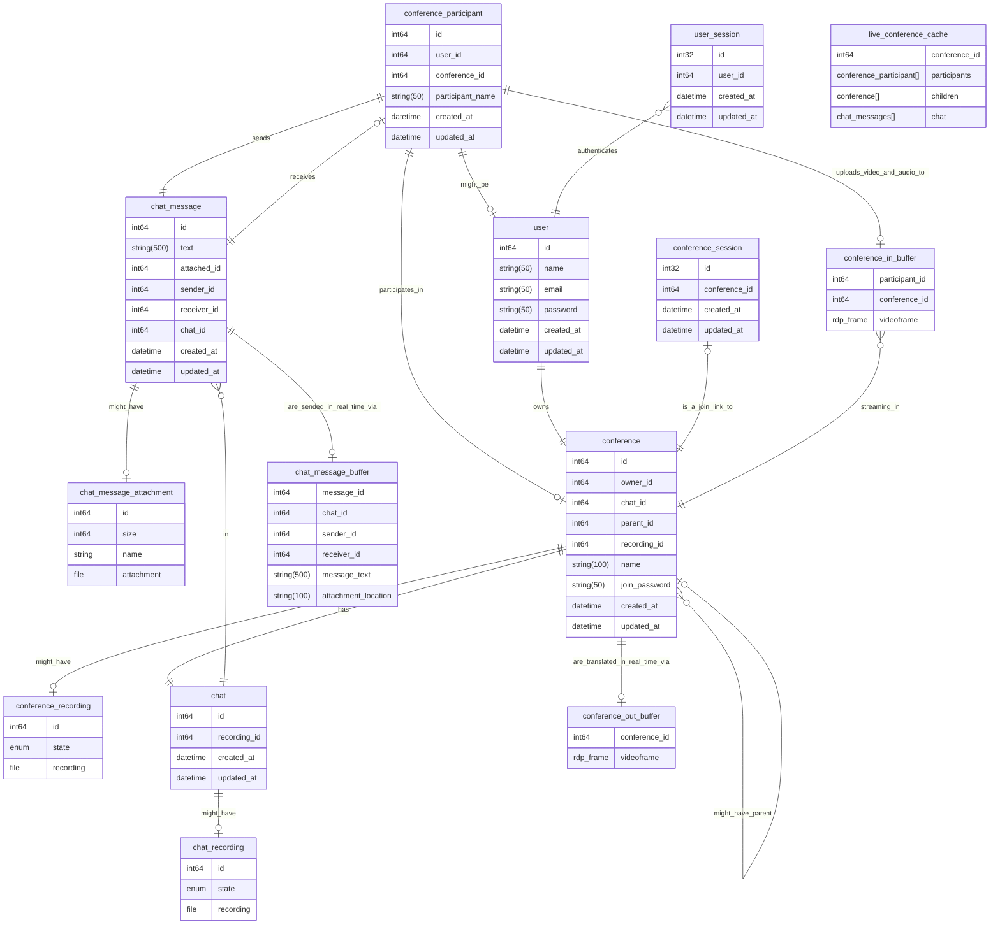

# Проектирование высоконагруженных систем. Zoom

Данный файл предназначен для документирования работы и принятых решений
в рамках курса проектирования высоконагруженных систем.

<!-- mtoc-start -->

* [1. Тема и целевая аудитория](#1-тема-и-целевая-аудитория)
  * [Продукт](#продукт)
  * [Функционал MVP](#функционал-mvp)
    * [Ключевые продуктовые решения](#ключевые-продуктовые-решения)
  * [Анализ целевой аудитории](#анализ-целевой-аудитории)
    * [Методологии оценки](#методологии-оценки)
      * [Monthly Active Users](#monthly-active-users)
      * [Распределение пользователей по миру](#распределение-пользователей-по-миру)
    * [Готовые цифры](#готовые-цифры)
    * [География пользователей](#география-пользователей)
* [2. Расчет нагрузки](#2-расчет-нагрузки)
  * [Продуктовые метрики](#продуктовые-метрики)
    * [Расчет средних значений](#расчет-средних-значений)
    * [Сводная таблица](#сводная-таблица)
  * [Технические метрики](#технические-метрики)
    * [Расчет размеров хранения медиафайлов](#расчет-размеров-хранения-медиафайлов)
    * [Расчет сетевого трафика](#расчет-сетевого-трафика)
    * [Расчет RPS](#расчет-rps)
* [3. Глобальная балансировка нагрузки](#3-глобальная-балансировка-нагрузки)
  * [Выбор и схема балансировки](#выбор-и-схема-балансировки)
  * [Разделение RPS по датацентрам](#разделение-rps-по-датацентрам)
* [4. Локальная балансировка нагрузки](#4-локальная-балансировка-нагрузки)
  * [Схема балансировки внешних запросов](#схема-балансировки-внешних-запросов)
  * [Схема балансировки межсервисных запросов](#схема-балансировки-межсервисных-запросов)
  * [Схема отказоустойчивости](#схема-отказоустойчивости)
  * [Терминация SSL](#терминация-ssl)
* [5. Логическая схема БД](#5-логическая-схема-бд)
  * [Описание сущностей](#описание-сущностей)
  * [Особенности распределения нагрузки по ключам](#особенности-распределения-нагрузки-по-ключам)
* [Список источников](#список-источников)

<!-- mtoc-end -->

## 1. Тема и целевая аудитория

### Продукт

Zoom - это платформа для проведения видеоконференций, которая в настоящее время
позиционирует себя как "рабочее место", включающее в себя коллективный чат,
доски, заметки, почтовый клиент, работу с документами и так далее.
Продукт приобрел широкую популярность благодаря пандемии и с тех пор занимает
лидирующее место среди аналогов.

Основной способ монетизации - разного рода подписки.

### Функционал MVP

* Регистрация и авторизация
* Создание конференции и подключение к ней
* Отдельные комнаты в рамках одной конференции (сессионные залы в терминах zoom)
* Запись конференции
* Чат в конференции (с возможностью прикладывать файлы)

#### Ключевые продуктовые решения

* Подключение к конференции не требует регистрации (по ссылке или id и паролю)
* Запись конференции происходит на стороне сервиса  
  (но возможна и локальная, её проектировать не будем)
* Чат также записывается при записи конференции

### Анализ целевой аудитории

Сразу обозначим, что вся доступная информация касательно аудитории zoom
приводится в открытых источниках только на момент разгара пандемии
(до 2021 года). Поэтому на самом деле мы будем проектировать zoom образца 2020 года.

#### Методологии оценки

В данном разделе описано, как рассчитаны показатели, явно отсутствующие в источниках.

##### Monthly Active Users

Zoom ни разу не публиковал данную метрику в открытый доступ, поэтому остается только
лишь её оценивать по другим показателям.
Казалось бы, можно было бы использовать статистику по уникальным посетителям
веб-сайта zoom.us [1]. Отметим несколько фактов, которые ответят нам на
вопрос "Можно ли?":

1. Подключение к конференции возможно по ссылке и по логину с паролем. В
   случае подключения по ссылке человек проходит через сайт zoom.us, однако
   только если он пользуется десктопной версией.
2. У zoom есть веб-клиент, а потому пользователи веб-клиента также
   считаются в эту метрику.

Таким образом, строго опираться на данную метрику нельзя, так как

* Не учитываются пользователи мобильных приложений;
* Не учитываются пользователи, подключающиеся не по ссылке.
* Учитываются боты и другие пользователи, не относящиеся к категории активных

Далее, приведем косвенную оценку MAU на конец 2020 года (4-й квартал).
Для данного периода нам известно

* Среднее время конференции (T): 54 минуты  [2]
* Среднее число человек, участвующих в конференции (n): 10  [2]
* Ожидаемое годовое число минут конференций ($t_{total}$): 3.3 триллиона минут.
   (zoom рассчитал эту метрику, умножив суммарное число минут конференций
   за декабрь 2020 на 12). [3]

Пусть число конференций, проведенных месяц, будет равно $N_{сум}$.
Тогда

$N_{сум} = \frac{t_{total}}{12T} = \frac{101 \cdot 10^{9}}{12 \cdot 54} \approx 155864197.5 \approx 156$ ($млн.)

В худшем случае, каждая из этих конференций содержала уникальных людей. С учетом
средней численности человек в конференции, оценкой сверху для MAU является

$\textit{MAU}_{max} = n * N = 10 \cdot 156 = 1.6 (млрд. чел)$

Итого мы получили крайне завышенное значение, которое нельзя использовать для расчета.

Придем к последнему варианту оценки. Возьмем в качестве оценки MAU
значение, которое публикует конкурент для своего продукта относительно
объема рынка, которое он занимает.
Так, Microsoft Teams заявляет 320 млн. MAU [4] на начало 2024 года.
Кроме того, zoom занимает 55.91% рынка, а Teams - 32.29% [5]. Значит
можно полагать, что

$\textit{MAU} \approx 320\cdot\frac{55.91}{32.29} \approx 554$ (млн.)

Отметим, что данное значение помещается в пределы оценки и выше
DAU (300 млн.) [6], значит можем использовать.

##### Распределение пользователей по миру

Для оценки этого параметра можем считать, что распределение пользователей,
которые генерируют трафик на zoom.us и пользователей, которые входят
в активную аудиторию совпадают.
Также был проверен и трафик других доменов zoom, но на них распределение
приблизителльно совпадало.

#### Готовые цифры

* 300 млн. Daily Active Users [6] (на 2020 год, но других данных нет)
* 554 млн. Monthly Active Users*

\*показатель получен косвенным путем

#### География пользователей

| Страна         | %     | MAU, млн. | DAU, млн. |
|----------------|-------|-----------|-----------|
| США            | 43.83 | 242.8     | 131.5     |
| Япония         | 7.74  | 42.9      | 23.2      |
| Индия          | 4.22  | 23.4      | 12.7      |
| Канада         | 3.94  | 21.8      | 11.8      |
| Великобритания | 3.74  | 20.7      | 11.2      |
| Остальные      | 36.53 | 202.4     | 109.6     |

## 2. Расчет нагрузки

### Продуктовые метрики

#### Расчет средних значений

Число регистраций можно оценить по отчету прибыли [7].
Сначала оценим долю MAU, которую составляют платные пользователи. Это
можно сделать, поделив выручку компании на цену платной подписки (\$12.5) [8].

$\textit{MAU}_\text{плат} \approx \frac{1146}{12.5} = 91.68$ (млн. чел)

Примем, что прирост платных пользователей для короткого срока (месяц-два)
имеет прямую пропорциональную зависимость с приростом всех пользователей, что
и означает регистрация. Тогда имеет место соотношение для числа регистраций в
месяц

$R=\Delta\textit{MAU}_\text{плат}\frac{\textit{MAU}}{\textit{MAU}_\text{плат}}$

$R \approx\frac{1146 - 1118}{12.5}\cdot\frac{554.00}{91.68}\approx 13.54$ (млн.)

Усредняя это число для суточного периода, имеем

$R_\text{ср. дн} = \frac{13.54}{30} \approx 0.451$ (млн.)

Для числа авторизаций проведем оценку сверху. Для этого
допустим, что все пользователи zoom авторизуются (в том
числе и те, кто анонимно заходит в конференцию).
Кроме того, допустим также, что пользователи заходят в
zoom каждый рабочий день (5 дней в неделю и 20 в месяц).

Кроме того, отметим мои собственные наблюдения:

* Для авторизаций на сайте zoom создает сессионную куку,
которая уничтожается при перезаходе в браузер (время жизни session).
* При каждом входе в приложение zoom обновляет авторизацию, будь то
авторизация по его собственным механизмам или же с помощью oauth.

Итого будем считать за авторизацию каждый заход в приложение или
на сайт в рамках браузерной сессии. Тогда за месяц в среднем
человек будет заходить в zoom 20 раз (по раз за рабочий день).
Итого будем иметь среднее число авторизаций за месяц

$A = 20 \cdot MAU = 11080 = 11.08$ (млрд. в мес).  
$A_\text{ср. дн} = \frac{A}{30} = \frac{11080}{30} \approx 369$ (млн. в день)

Число созданий конференций можно оценить по самому числу
конференций. Уже известно, что
среднее число конференций в месяц равно 156 млн. Тогда в день имеем

$N_\text{ср. дн} = \frac{156}{30} \approx 5.2$ (млн.)

Учитывая среднее число участников конференций (10 человек), среднее
число участий будет равно

$5.2 \cdot 10 = 52$ (млн.)

Примем, что каждая третья конференция Zoom записывается.
Тогда среднее число записей будет равно

$5.2 / 3 = 1.73$ (млн.)

Примем, что каждый пользователь в среднем оставляет 10 сообщений в чате.
При этом 10% сообщений прикладывают файл.
Тогда среднее число сообщений в чате равно

$52 \cdot 10 = 520$ (млн.),

а среднее число файлов в чате

$520 \cdot 0.1 = 52$ (млн.)

Пусть только 10% конференций содержат сессионные залы.
При этом в среднем их будет 3. Тогда  
Среднее число созданий сессионного зала  $5.2 \cdot 0.1 \cdot 3 = 1.56$ млн.  
Среднее число участий в сессионном зале  $52 \cdot 0.1 \cdot 3 = 15.6$ млн.  
Среднее число записей сессионного зала  $1.73 \cdot 0.1 \cdot 3 = 0.519$ млн.

Средний размер хранилища пользователя складывается из
среднего объема записей конференций и медиафайлов в чате.
Его оценка приведена в разделе с техническими метриками.

#### Сводная таблица

| Метрика | млн. пользователей |
|---------|--------------------|
| DAU     | 300                |
| MAU     | 554                |

Средний размер хранилища пользователя: 1.15 ГБ. (Расчет для него приведен далее).

| Действие пользователя    | Среднее количество в сутки, шт. |
|--------------------------|---------------------------------|
| Регистрация              |         0.451 млн.              |
| Авторизация              |         369 млн.                |
| Создание конференции     |         5.2 млн.                |
| Участие в конференции    |         52 млн.                 |
| Запись конференции       |        1.73 млн.                |
| Сообщение в чате         |        520 млн.                 |
| Файл в чате              |        52 млн.                  |
| Создание сессионного зала|        1.56 млн.                |
| Участие в сессионном зале|        15.6 млн.                |
| Запись сессионного зала  |        0.519 млн.               |

\* В сущности числа для сессионых залов необязательны, так как сессионный зал является
подвидом конференции.  

### Технические метрики

#### Расчет размеров хранения медиафайлов

Произведем расчет для медиафайлов. Начнем с самого простого - размера файла.
Известно, что в Zoom максимальный размер файла, который можно прикрепить,
равен 1 Гб [9]. Однако далеко не все люди прикрепляют
такие файлы. Поэтому примем, что средний размер файла 10 Мб.

Далее, расчитаем размер записи конференции. Считать будем исходя из того,
что Zoom умеет передавать видео в формате FullHD 1080p [10].

Также отметим особенности Zoom. На записи он показывает только один экран
одновременно. Кроме того, Zoom также
предоставляет записи в формате mp4. Примем, исходя из данных [11] о битрейте, что
в записи хранится картинка максимального качества с битрейтом 3.8 Мбит/c. Тогда
средняя конференция Zoom (54 минуты) занимает

$V = 3.8 \cdot 60 \cdot 54  = 12$ (Гбайт.)

Для размера потока живой конференции мы также можем взять данные Zoom, а именно
битрейт для групповых звонков 3.8 Мбит/с. (Это битрейт для максимального качества
конференции. Но так как мы занимаемся проектированием, то разумно брать запасы).

С учетом того что сессионные залы это тоже конференции, расчет для них не отличается.

Отсюда мы можем получить средний объем хранилища пользователя как суммарное число
записанных конференций плюс суммарное число файлов, приходящихся на одного пользователя.

$V_\text{пол. ср} = \frac{30}{MAU} \left[ V N_\text{зап. сут} + V_\text{файл. ср} N_\text{файл. сут.} \right]$

$V_\text{пол. ср} = \frac{30}{554 \cdot 10^6} \left[ 12 \cdot 1.73 \cdot 10^6 + 10 / 1024 \cdot 52 \cdot 10^6 \right] \approx 1.15$ (Гбайт)

#### Расчет сетевого трафика

Основной трафик, который генерируется в рамках zoom, генерируется за счет
конференций. А потому, расчет
нужен только для видео и файлов.

Для видео уже посчитали битрейт 3.8 Мбит/с на конференцию,
а также средний размер конференции 12 Гбайт.
С учетом их количества, имеем

$12 \cdot 1.73\approx 20.76$ (млн. Гбайт. в сутки)

Для файлов аналогично найдем

$10 / 1024 \cdot 52 \approx 0.51$ (млн. Гбайт в сутки)

Для подсчета пиковых значений было проведено следующее исследование:

* Был проведен поиск статистики по дневному трафику zoom
* Был проведен поиск статистики по дневному трафику аналогов zoom
* Был проведен поиск графиков дневного трафика на технических конференциях

Ни один из обозначенных выше способов не дал результата, поэтому для подсчета
пикового RTS возьмем график трафика через один из internet exchange. Это
можно использовать для оценки, так как

* Графики локального трафика приблизительно имеют одну и ту же форму
* Около половины аудитории zoom расположены в США и США обладает достаточно
  близкими часовыми поясами (максимальная разница во времени 6 часов), что
  подойдет для оценки.

Для расчета возьмем форму графика трафика, которым поделился SeattleIX [12].

Далее, берем период с 22:00 до 22:00 следующего дня, интегрируем его и делим на 24
часа. Получим среднее значение для трафика для SIX. Далее, с помощью пропорции получаем
отношение пикового трафика к среднему. И это отношение используем для расчета пикового
RPS и сетевого трафика.

Для SIX средний трафик приведен на картинке и равен 2.54 Тб. Причем его максимальное
значение
равно 3.38 Тб. Таким образом, коэффициент перегрузки трафика равен

$K = \frac{3.38}{2.54} \approx 1.33$

Подобные графики были просмотрены и для других IX. Для запаса берем коэффициент
перегрузки 1.5.

Теперь посчитаем пиковый трафик для медиафайлов. Для этого сначала считаем
среднесуточный трафик, а затем умножаем его на коэффициент перегрузки.

Для видеопотоков получается

* Средний $20.76 \cdot 10^6 / 24 / 60 / 60 \approx 240$ (Гбайт в сек)
* Пиковый $240 \cdot 1.5 = 360 = 2880$ (Гбит в сек)

Для файлов в чате

* Средний $0.51 \cdot 10^6 / 24 / 60 / 60 \approx 6$ (Гбайт в сек)
* Пиковый $6 \cdot 1.5 = 72$ (Гбит в сек)

#### Расчет RPS

Средний RPS был посчитан из продуктовых метрик в расчете не секунду по
формуле

$RPS = \frac{M_\text{ср}}{24 \cdot 60 \cdot 60}$,

где M - среднее значение метрики за сутки.

Пиковый же RPS получен из среднего при помощи коэффициента, рассчитанного
ранее.

| Действие пользователя    | Средний RPS  | Пиковый RPS |
|--------------------------|--------------|-------------|
| Регистрация              |        5.22  |       7.83  |
| Авторизация              |        4270  |       6405  |
| Создание конференции     |        60    |       90    |
| Участие в конференции    |        600   |       900   |
| Запись конференции       |        20    |       30    |
| Сообщение в чате         |        6018  |       9027  |
| Файл в чате              |        602   |       903   |
| Создание сессионного зала|        18    |       27    |
| Участие в сессионном зале|        180   |       270   |
| Запись сессионного зала  |        6     |       9     |

## 3. Глобальная балансировка нагрузки

### Выбор и схема балансировки

В качестве метода балансировки нагрузки выберем DNS балансировку
нагрузки. Выбор связан с тем, что наша целевая аудитория широко
распространена по Земле и использование BGP Anycast было бы
затруднительно, так как оно требует наличие автономной системы
мировых размеров.

Тип DNS балансировки выбираем Latency-based в совокупности с
DNS Round Robin. В таком случае, выбор датацентра по
доменному имени будет происходить следующим образом:

* Пользователь обращается к домену zoom.us.
* DNS-сервер согласно
  аналитике о задержках маппит данный домен при помощи записи
  A ALIAS на, к примеру, домен eu.zoom.us (европейский регион)
* Далее, DNS сервер по схеме DNS Round Robin резолвит доменное
  имя eu.zoom.us в виде списка из IP адресов локальных датацентров.

Данная схема поддерживается AWS, и его мы можем выбрать в качестве
провайдера датацентров (? возможно ошибся с термином, но суть
должна быть ясна).

Остается лишь распределить датацентры по миру согласно нашей аудитории.
Напомним, что пропорции мировой аудитории распределены следующим образом:

* США 43.83%
* Япония 7.74%
* Индия 4.22%
* Канада 3.84%
* Великобритания 3.74%
* Остальной мир 36.53%

Таким образом, из анализа этих процентов, следует разместить по паре
датацентров в США на разных географических точках. Они будут обслуживать
клиентов из США и Канады. Также нужна пара датацентров в Японии, Европе
(один из которых нужен в Лондоне) и Индии.

Дублирование датацентров нужно для обеспечения надежности: если один из
датацентров умрет, то оставшийся сможет перехватить нагрузку. Кроме того,
дублирование датацентров не является обязательным и при нехватке средств
можно пожертвовать датацентрами в США (там их 4), а также датацентрами
в Индии и Японии (они относительно близко расположены).

Итого, выбираем следующие датацентры [13]:

* Северная Виржиния (Восток США), 12.48% аудитории
* Огайо (Восток США), 12.48% аудитории
* Орегон (Запад США), 12.48% аудитории
* Северная Калифорния (Запад США), 12.48% аудитории
* Лондон (Западная Европа) 15.91% аудитории
* Франкфурт (Западная Европа) 12.17% аудитории
* Осака (Япония) 3.87% аудитории
* Токио (Япония) 3.87% аудитории
* Хайдарабад (Индия) 2.11% аудитории
* Мумбаи (Индия) 2.11% аудитории

Расчет распределения аудитории произведен на основании допущения,
что жители одного региона (указан в скобках) равномерно обращаются
к датацентрам. Кроме того, мы считаем, что жители Канады идут в
датацентры США, а также что остальной мир на 2/3 это жители Европы, а оставшаяся
треть равномерно уходит во все датацентры.

### Разделение RPS по датацентрам

Ячейки имеют формат (средний RPS, пиковый RPS)

| Запрос                   | Сев. Вирджиния, Огайо, Орегон и Сев. Калифорния | Лондон       | Франкфурт    | Осака и Токио | Хайдабарад и Мумбаи |
|--------------------------|-------------------------------------------------|--------------|--------------|---------------|---------------------|
| Регистрация              | 0.7/1.0                                         | 0.8/1.2      | 0.6/0.9      | 0.2/0.3       | 0.1/0.2             |
| Авторизация              | 532.9/800.0                                     | 679.4/1019.1 | 519.7/779.6  | 165.2/247.8   | 90.1/135.2          |
| Создание конференции     | 7.5/11.3                                        | 9.5/14.3     | 7.3/11.0     | 2.3/3.6       | 1.3/2.0             |
| Участие в конференции    | 74.8/112.2                                      | 95.5/143.3   | 73.0/109.5   | 23.2/34.8     | 12.7/19.1           |
| Запись конференции       | 2.5/3.8                                         | 3.2/4.8      | 2.4/3.6      | 0.8/1.2       | 0.4/0.6             |
| Сообщение в чате         | 751/1126.5                                      | 957.5/1436.3 | 732.4/1098.6 | 232.9/349.4   | 127.0/191.0         |
| Файл в чате              | 75/112.5                                        | 95.8/143.7   | 73.3/110.0   | 23.3/35.0     | 12.7/19.1           |
| Создание сессионного зала| 2.3/3.4                                         | 2.9/4.4      | 2.2/3.3      | 0.7/1.1       | 0.4/0.6             |
| Участие в сессионном зале| 22.5/33.8                                       | 28.6/42.9    | 21.9/32.85   | 7.0/11.0      | 3.8/5.7             |
| Запись сессионного зала  | 0.8/1.1                                         | 1.0/1.5      | 0.7/1.1      | 0.2/0.3       | 0.1/0.2             |

## 4. Локальная балансировка нагрузки

### Схема балансировки внешних запросов

На входе в датацентр: BGP балансировка. Нужна для балансировки нагрузки
между следующими в каскаде балансировщиками.

Далее, запрос маршрутизируется на один из нескольких L7-балансировщиков (Nginx).
Nginx анализирует запрос и разделяет его в зависимости от того, что пользователю
нужно: статика, веб-сайт или конференции.

В случае, если запрос идет не за статикой, он переходит в кластер k8s. В кластере
стоит уже свой ingress-nginx, распределяющий нагрузку по сервисам. В этом же месте
происходит терминация SSL.

Также для реализации звонков потребуется балансировка на уровне приложения. Если
запрос направлен на URL звонка, то возможна ситуация, когда пользователь придет
не в тот ЦОД и его необходимо отправить в другой. Для этого будет использована
балансировка при помощи специального сервера, который будет по ID конференции
выдавать IP ЦОД, куда нужно подключаться к звонку. Эта балансировка стоит сразу
после первого каскада Nginx.

### Схема балансировки межсервисных запросов

Межсервисное взаимодействие строится при помощи sidecar proxy, реализуемую
при помощи k8s.

### Схема отказоустойчивости

* Защита от падения BGP балансера (умер датацентр) - решается на этапе
  глобальной балансировки

* Защита от падения L7 балансировщика - используем схему основной-запасной.
  Будем иметь 2 сервера, которые имеют один и тот же IP, причем у одного
  этот IP на виртуальном интерфейсе, а у другого - на физическом.
  Таким образом, если умрет Nginx на физическом интерфейсе,
  то Nginx на виртуальном  подхватит.

* Отказоустойчивость бэкендов реализуется k8s кластером. Если какой-либо
  сервис вышел из строя, внешний балансировщик повторит запрос. При этом
  упавший сервис начнет перезапуск.

### Терминация SSL
  
Терминацию SSL необходимо производить на входе в k8s кластер. Раньше
нельзя, так как запрос может быть направлен не на бэкенд, а в хранилище
статики.

## 5. Логическая схема БД

*Примечание*. Названия типов приведены условно, так как они зависят от выбора
конкретной СУБД.

*Примечание 2*. Для conference_cache связи не указаны, чтобы сохранить читаемость схемы.

### Описание сущностей

| Сущность                | Назначение                                                                   | Дополнительные требования к консистентности                                                         | Объем единицы сущности |
|-------------------------|------------------------------------------------------------------------------|-----------------------------------------------------------------------------------------------------|------------------------|
| user_session            | Хранение сессий зарегистрированных пользователей                             | Отсутствуют                                                                                         | 28 байт                |
| conference_participant  | Хранение данных участника конференции                                        | Отсутствуют                                                                                         | 80 байт                |
| user                    | Хранение данных зарегистрированного пользователя                             | Отсутствуют                                                                                         | 174 байт               |
| conference              | Хранение данных конференции                                                  | Создается одновременно с chat                                                                       | 206 байт               |
| conference_session      | Хранение сессии конференции (для реализации подключения по ссылке)           | Время жизни заканчивается после завершения конференции                                              | 28 байт                |
| conference_out_buffer   | Реализация publisher-subscriber для видеопотока живой конференции            | Уничтожается после завершения конференции                                                           | 3.8 Мбит               |
| conference_in_buffer    | Реализация publisher-subscriber для видеопотока живой конференции            | Уничтожается с выходом conference_participant из конференции                                        | 3.8 Мбит               |
| conference_recording    | Хранение записи конференции (Файловое хранилище, имеет схему с кэшированием) | Отсутствуют, так как сущность не может быть изменена после создания                                 | ~12 Гбайт              |
| chat                    | Хранение чата конференции                                                    | Создается одновременно с conference                                                                 | 32 байт                |
| chat_recording          | Хранение записи чата (Файловое хранилище, кэш)                               | Отсутствуют, так как сущность не может быть изменена после создания                                 | Не фиксируется ~ 6 кБ  |
| chat_message            | Хранение сообщения в чате                                                    | Отсутствуют                                                                                         | 556 байт               |
| chat_message_attachment | Хранение прикрепленных файлов в чате (Файловое хранилище)                    | Нужно удалять, если удаляется chat_message, содержащий её                                           | ~10 Мб                 |
| chat_message_buffer     | Реализация publisher-subscriber для сообщений в чате                         | Состоит из дублирующихся данных, но живет мало. attachment_location указывает на прикрепленный файл | 632 байт               |

### Особенности распределения нагрузки по ключам

* Практически каждый пользователь сходит в таблицу conference для получения данных о конференции. Поэтому на
  неё приходится большая часть продуктовой нагрузки на чтение

* Для chat и conference применен partitioning.
  Это нужно для того, чтобы разделить запросы по доменам

* conference_participant, помимо сопоставимой нагрузки на чтение,
  как и для conference, обладает такой же нагрузкой и на запись, так как
  conference_participant создается для КАЖДОЙ конференции для КАЖДОГО её участника.
  Поэтому для доступа к производной информации о участнике используется кэш, который
  умирает вместе с остановкой конференции.

## Список источников

1. [Worldwide visits to Zoom.us from October 2023 to March 2024](https://www.statista.com/statistics/1259905/zoom-website-traffic/)
2. [Here's How You Zoomed Over the Past Year](https://www.zoom.com/en/blog/how-you-zoomed-over-the-past-year-2021/)
3. [Analyst Day October 14, 2020](https://investors.zoom.us/static-files/cc304d8e-12cd-464d-9546-d0ef22a6e708)
4. [Microsoft Fiscal Year 2024 First Quarter Earnings Conference Call](https://www.microsoft.com/en-us/investor/events/fy-2024/earnings-fy-2024-q1)
5. [Market share of videoconferencing software worldwide in 2024, by program](https://www.statista.com/statistics/1331323/videoconferencing-market-share/)
6. [90-Day Security Plan Progress Report: April 22](http://web.archive.org/web/20200423091751/https://blog.zoom.us/wordpress/2020/04/22/90-day-security-plan-progress-report-april-22/)
7. [Zoom Fourth Quarter 2024 Earnings Webinar Earnings Presentation](https://investors.zoom.us/financial-information/quarterly-results)
8. [Официальный сайт Zoom](https://zoom.us/pricing)
9. [Managing file transfers in Zoom Team Chat](https://support.zoom.com/hc/ru/article?id=zm_kb&sysparm_article=KB0059136)
10. [Enhancing your video in Zoom](https://support.zoom.com/hc/en/article?id=zm_kb&sysparm_article=KB0060352)
11. [Zoom system requirements: Windows, macOS, Linux](https://support.zoom.com/hc/en/article?id=zm_kb&sysparm_article=KB0060748#:~:text=Zoom%20Meeting%20and%20Webinar,-Recommended%20bandwidth%20for&text=For%201%3A1%20video%20calling,3.0Mbps%20(up%2Fdown))
12. [SIX Aggregate Bits - 5 minute sampling](https://www.seattleix.net/statistics/#daily)
13. [AWS Global Infrastructure](https://aws.amazon.com/ru/about-aws/global-infrastructure)
